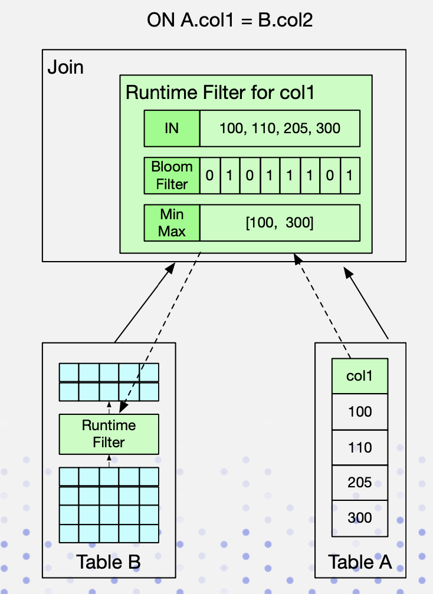

# Doris笔记

## 核心特性

### 极致性能

高效列式存储引擎

现代化MPP架构

向量化执行引擎

智能物化视图

优秀的Join表现

高并发

### 简单易用

支持 ANSI SQL

兼容MySQL协议

灵活的数据模型

在线表结构变更？

Bitmap索引精确去重

### 流批一体

批量和实时流式数据导入

行级数据更新/删除

MVCC机制解决读写冲突

导入支持事务，保证ACID

实现Exactly-Once语义

### 极简运维

无外部依赖

集群规模弹性伸缩

任何节点可线性扩展

无代码即可完成运维

### 可用性高

主节点高可用

数据多副本存储

节点故障自动迁移

自动请求路由

数据分片自动均衡

### 生态丰富

BOS/HDFS/Kafka等数据无缝导入

Spark联邦数据分析

为ES提供分布式SQL查询

主流工具适配

## 架构

主从架构，不依赖其他组件。

FE负责解析、生成、调度执行计划，存储元数据

BE负责执行查询计划、数据存储

任何节点可线性扩展

## 数据模型与物化视图

## Join

### 物理算子

| 物理算子       | 性能 | 场景                 |
| -------------- | ---- | -------------------- |
| Hash Join      | 块   | 等值Join             |
| Nest Loop Join | 慢   | 不等值Join或笛卡尔积 |

### shuffle方式

- 存在S与R join操作

- N表示参与join计算的instance数

- T表示关系的tuple数目

| Shuffle方式         | 网络开销    | 物理算子                 | 适用场景                                                     |
| ------------------- | ----------- | ------------------------ | ------------------------------------------------------------ |
| BroadCast Join      | N * T(R)    | Hash Join/Nest Loop Join | 通用                                                         |
| Shuffle Join        | T(S) + T(R) | Hash Join                | 通用                                                         |
| Bucket Shuffle Join | T(R)        | Hash Join                | Join条件中存在左表的分布式列，且左表执行时为单分区           |
| Colocate Join       | 0           | Hash Join                | Join条件中存在左表的分布式列，且左右表同属于一个Colocate Group |

### 动态分区裁剪

Hash Join右表构建Hash表时生成过滤条件，下推到左表。支持三种类型：IN，Bloom Filter，MinMax。

MinMax/BloomFilter在shuffle join的时候需要合并

Key列的过滤条件会下推到存储引擎，提升延迟物化效果

| Runtime Filter | 优点                 | 缺点                     | 适用场景       |
| -------------- | -------------------- | ------------------------ | -------------- |
| IN             | 开销小，效果显著     | 右表超过一定数据量后失效 | Broadcast Join |
| MinMax         | 开销相对较小         | 仅对数值类型有较好效果   | 通用           |
| BloomFilter    | 适用各种类型，效果好 | 配置复杂，代价高         | 通用           |

### Join Reorder

多表join的时候join顺序对性能影响比较大：

1. 优先大表与小表做join
2. 尽量前置有条件列的表
3. Hash Join优先级高于Nest Loop Join

### 调优实践

Join调优方法论：

1. 根据Doris执行的Profile信息进行瓶颈定位
2. 通过Doris的join机制，分析可能的优化方式
3. 利用Session变量改变Join行为，进行调优
4. 分析Query Plan验证调优是否生效
5. 如果不奏效，需要改写Join语句/调整数据分布

Join调优案例：

| 案例                   | 问题定位                                                     | 调整                     | 效果        |
| ---------------------- | ------------------------------------------------------------ | ------------------------ | ----------- |
| 右表为大表，左表为小表 | 查看Profile                                                  | 开启Join reorder         | 14s -> 3.5s |
| RuntimeFilter没有生效  | 查看Profile过滤效果比较好，查看Query Plan发现IN filter没有生效 | 改为BloomFilter          | 44s -> 13s  |
| 右表大表，过滤后变小表 | 查看Profile发现右表为大表，却选择了Broadcast Join            | 使用Hint改为Shuffle Join | 4min -> 9s  |

最佳实践原则：

- Join列尽量使用相同类型/简单类型/Key列：减少Cast，尽可能谓词下推
- 大表之间Join尽量使用Colocate Join
- 合理使用RuntimeFilter：过滤高的场景显著，某些场景有副作用，建议以SQL为粒度开启
- 判断Join顺序合理性：尽量确保左表为大表，右表为小表，必要时候使用Hint调整

### 参考

[Apache Doris 的Join实现与调优技巧实践](https://www.slidestalk.com/Baiyulan/ApacheDorisJoin70066?video)

## 导入机制

### 一致性语义

### 事务和两阶段提交

1. FE充当协调者
2. Prepare阶段下发任务和写入数据
3. Submit阶段
   1. 数据状态改为Committed
   2. publish版本
   3. 状态改为visiable

### Doris实现

Phase1 FE Leader：

1. 创建事务
2. 规划导入执行计划
3. 分发子任务

Phase1 BE：

1. 接受查询计划
2. 初始化ScanNode
3. 初始化TableSink和Table writer
4. ETL
5. 汇报导入结果

Phase 2 Publish：

1. 收集导入任务汇报结果
2. 发送Publish消息
3. 事务状态改为Committed
4. 等待BE返回
5. 修改BE元数据，版本加1
6. 修改FE元数据，版本加1
7. 事务状态改为Visible

Rollback：

1. 事务状态改为Abort
2. BE等待回收任务删除已写入数据

### 总结

多版本机制解决读写冲突

两阶段导入保证多表原子生效

### 参考

[Doris的数据导入机制以及原子性保证](https://www.slidestalk.com/AICUG/Doris59081?video)

## 索引

查询时, 如果指定了维度列的等值条件或者范围条件, 并且这些条件中维度列可构成表维度列的前缀, 则可以利用数据的有序性, 使用range-scan快速锁定目标行. 例如: 对于表table1: (event_day, siteid, citycode, username)➜(pv); 当查询条件为event_day > 2020-09-18 and siteid = 2, 则可以使用范围查找; 如果指定条件为citycode = 4 and username in ["Andy", "Boby", "Christian", "DorisDB"], 则无法使用范围查找.

表中数据组织有主要由三部分构成:

1. shortkey index表:  表中数据每1024行, 构成一个逻辑block. 每个逻辑block在shortkey index表中存储一项索引, 内容为表的维度列的前缀, 并且不超过36字节.  shortkey index为稀疏索引, 用数据行的维度列的前缀查找索引表, 可以确定该行数据所在逻辑块的起始行号.
2. Per-column data block: 表中每一列数据按64KB分块存储,  数据块作为一个单位单独编码压缩, 也作为IO单位, 整体写回设备或者读出.
3. Per-column cardinal index:  表中的每列数据有各自的行号索引表,  列的数据块和行号索引项一一对应, 索引项由数据块的起始行号和数据块的位置和长度信息构成, 用数据行的行号查找行号索引表, 可以获取包含该行号的数据块所在位置, 读取目标数据块后, 可以进一步查找数据.

由此可见, 查找维度列的前缀的查找过程为:  先查找shortkey index, 获得逻辑块的起始行号, 查找维度列的行号索引, 获得目标列的数据块, 读取数据块, 然后解压解码, 从数据块中找到维度列前缀对应的数据项.

列级别的索引技术:  Bloomfilter可快速判断数据块中不含所查找值, ZoneMap通过数据范围快速过滤待查找值, Bitmap索引可快速计算出枚举类型的列满足一定条件的行.

聚合模型能够join吗？聚合模型怎么回溯数据？

Bitmap索引：

1. 对于明细模型，所有列都可以建Bitmap 索引；对于聚合模型，只有Key列可以建Bitmap 索引。
2. Bitmap索引, 应该在取值为枚举型, 取值大量重复, 较低基数, 并且用作等值条件查询或者可转化为等值条件查询的列上创建.
3. 不支持对Float、Double、Decimal 类型的列建Bitmap 索引。
4. 如果要查看某个查询是否命中了Bitmap索引，可以通过查询的Profile信息查看（TODO：加上查看Profile的链接）。

Bloom filter索引：

- 不支持对Tinyint、Float、Double 类型的列建Bloom Filter索引。
- Bloom Filter索引只对in和=过滤查询有加速效果。
- 如果要查看某个查询是否命中了Bloom Filter索引，可以通过查询的Profile信息查看（TODO：加上查看Profile的链接）。

一个导入作业通常会分布在多个BE上执行，内存参数限制的是一个导入作业在单个BE上的内存使用，而不是在整个集群的内存使用。

索引类型：

- OrdinalIndex：存放列的稀疏索引meta信息。
- ZoneMapIndex：存放ZoneMap索引的meta信息，内容包括了最大值、最小值、是否有空值、是否没有非空值。SegmentZoneMap存放了全局的ZoneMap信息，PageZoneMaps则存放了每个页面的统计信息。
- BitMapIndex：存放BitMap索引的meta信息，内容包括了BitMap类型，字典数据BitMap数据。
- BloomFilterIndex：存放了BloomFilter索引信息。

### Bitmap

