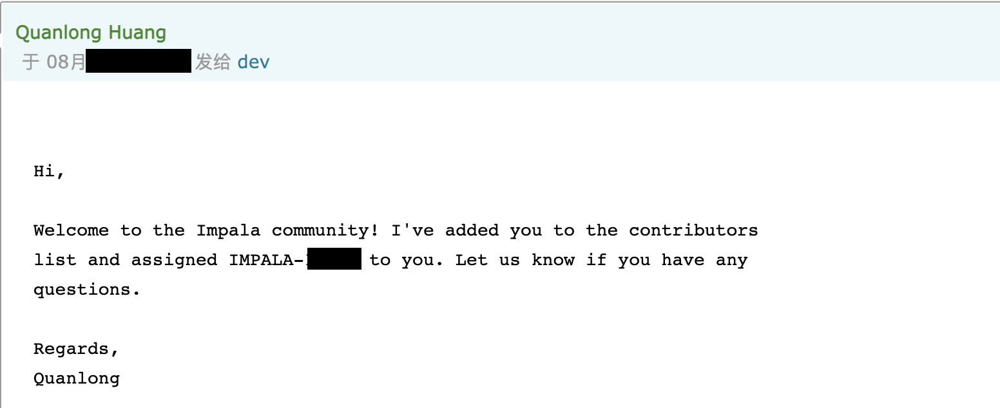
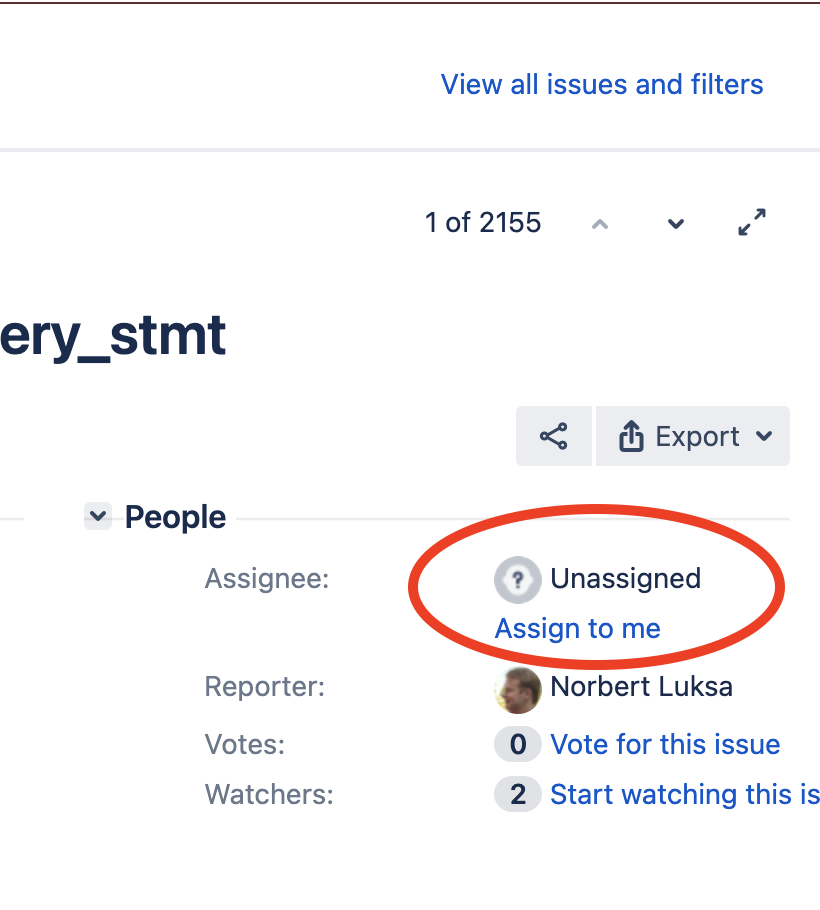
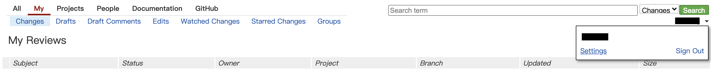
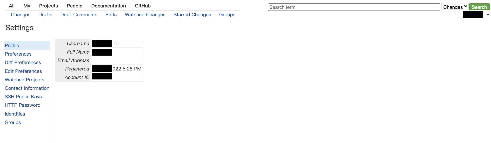
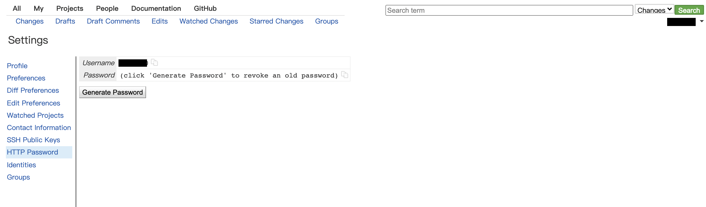

# Impala社区

## 贡献代码

### 提交Issue

如果想给Impala社区报告Bug，或者贡献feature以及文档，首先去[Jira搜索](https://issues.apache.org/jira/issues/?jql=project%20%3D%20IMPALA) 里搜一下该问题有没有人已经提过，如果没有那么就可以在[Impala Jira Tracker](https://issues.apache.org/jira/projects/IMPALA/) 上提一个新的issue以记录问题。

如果没有Apache Jira账号需要先注册：[Sign up for Jira](https://issues.apache.org/jira/secure/Signup!default.jspa)。登录之后点击页面上的Create按钮会出现一个 Create Issue 弹窗，Issue Type选择一种类型，如果要报告Bug就选红色的Bug，不同的类型模板不一样。JIra有下图这么多种类型：


带红色星号的都是必填项，其中Summary是对问题的一个简要描述，Compenent是选择问题所属的组件，有下图这么几种：


在Description里面可以具体描述问题，最好把相关的上下文信息都写清楚，比如Impala版本，相关组件配置等等。

### 订阅dev邮件

Issue创建完成之后可能并没有指派人，也没有权限指派给自己。这个时候需要先订阅一下Impala开发者邮件：

发邮件给[dev-subscribe@impala.apache.org](mailto:dev-subscribe@impala.apache.org)：


按照提示回复确认邮件：


需要注意的是所有发到邮件组的信息都是公开可查看的，不要把无关的或者个人信息误发出去。

### 指派Issue

然后发英文邮件到dev@impala.apache.org说你的Apache JIRA Id是xxx，你想解决的Issue是IMPALA-xxx：


社区大佬会把你加到contributor列表里：



以后就有权限给自己分活了：



### 参考

[Contributing to Impala](https://cwiki.apache.org/confluence/display/IMPALA/Contributing+to+Impala)

[Using Gerrit to submit and review patches](https://cwiki.apache.org/confluence/display/IMPALA/Using+Gerrit+to+submit+and+review+patches)

[Impala Community](https://impala.apache.org/community.html)

## 提交代码

### 登录

Impala使用gerrit管理代码，托管在https://gerrit.cloudera.org。需要使用Github账号进行登录验证：

点击页面右上角`Github Sign-in`链接进行登录：


### 添加SSH公钥

单击页面右上角用户名，在弹出的菜单点击Settings进入配置：



点击左侧的Profile，配置username和email地址：



点击SSH Public Keys，将公钥内容粘贴到右侧输入框，点击add进行确认：


### 配置git remote

ssh协议与http协议二选一：

SSH协议方式：

```shell
cd ${IMPALA_HOME}
git remote add asf-gerrit ssh://<your-github-username>@gerrit.cloudera.org:29418/Impala-ASF

```

HTTP协议方式：

```shell
cd ${IMPALA_HOME}
git remote add asf-gerrit http://<your-github-username>@gerrit.cloudera.org:8080/a/Impala-ASF
```

需要输入账号和密码的时候，需要从页面获取专用用户名和密码：



### 安装 pre-commit hook

Gerrit通过唯一`Change-Id`来跟踪不同的patch，`Change-Id`会追加到Commit信息里，没有`Change-Id`的话Gerrit会拒绝该次提交。

安装pre-commit hook来自动生成`Change-Id`：

```shell
cd ${IMPALA_HOME}
curl -o .git/hooks/commit-msg https://gerrit.cloudera.org/tools/hooks/commit-msg
chmod u+x .git/hooks/commit-msg
```

### 提交Patch

如果不想让reviewer看到，提交到分支：`refs/drafts/<branch-name>`；

如果已经准备好了，可以让reviewer来review，提交到分支：`refs/for/<branch-name>`。

大部分情况下`<branch-name>`是master。

提交一个草稿的示例：

```
$ git push asf-gerrit HEAD:refs/drafts/master
Counting objects: 3, done.
Delta compression using up to 8 threads.
Compressing objects: 100% (3/3), done.
Writing objects: 100% (3/3), 332 bytes | 0 bytes/s, done.
Total 3 (delta 2), reused 0 (delta 0)
remote: Resolving deltas: 100% (2/2)
remote: Processing changes: new: 1, refs: 1, done
remote:
remote: New Changes:
remote:   http://gerrit.cloudera.org:8080/8335 test [DRAFT]
remote:
To ssh://XXXX@gerrit.cloudera.org:29418/Impala-ASF
```

如果确认更改无误，可以点击右侧的publish按钮发布到社区。变更中的每个commit都会被翻译成一封邮件发送给每位成员。

### 参考

[Using Gerrit to submit and review patches](https://cwiki.apache.org/confluence/display/IMPALA/Using+Gerrit+to+submit+and+review+patches)
