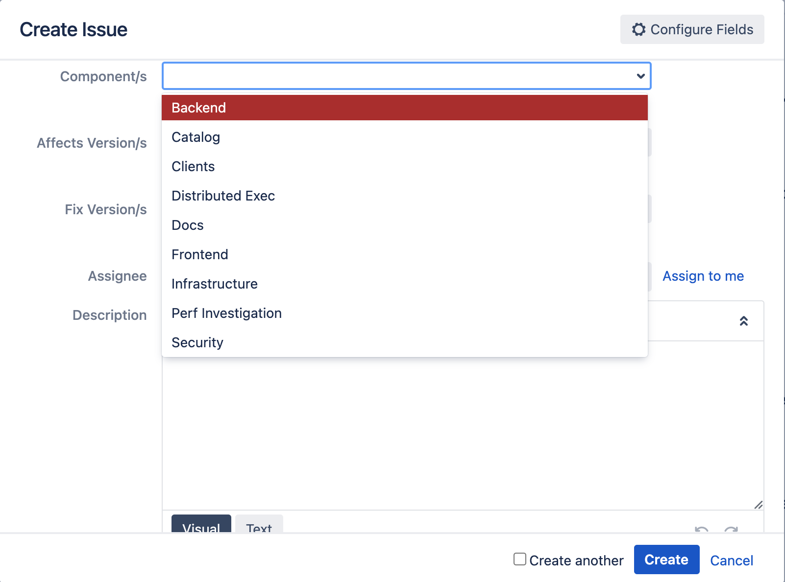
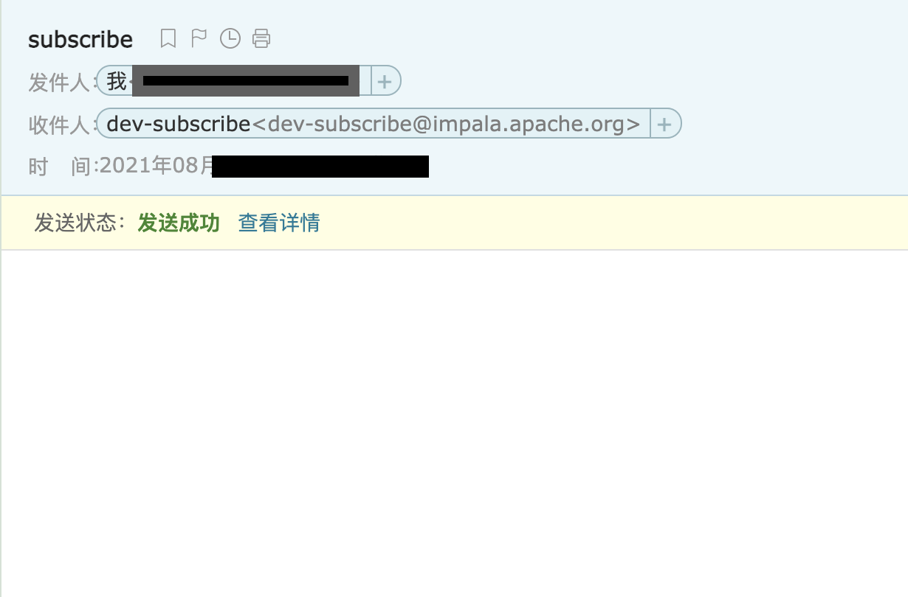
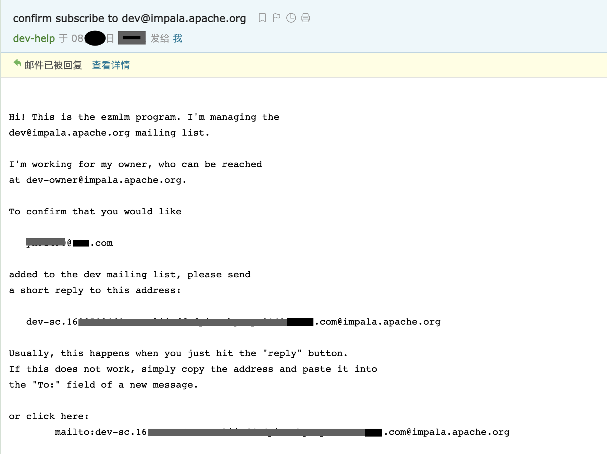
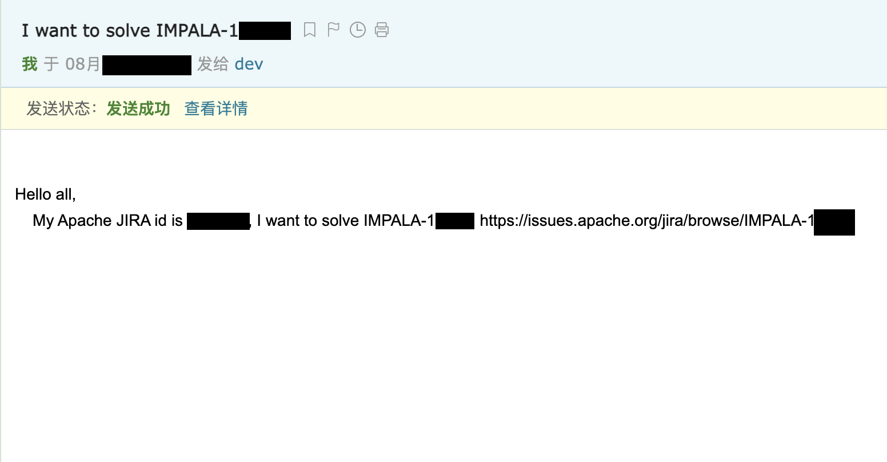

# Impala开发笔记

## 编译构建

执行脚本：

```shell
bash bin/bootstrap_system.sh
source bin/impala-config.sh
buildall.sh -release -notests
```

## 源码分析

### bin/bootstrap_system.sh

为开发环境做些准备，大体执行流程：

- 导出环境变量 IMPALA_HOME
- 如果是交互模式，询问是否愿意更改环境配置，是则继续，否则退出
- 判断发行版版本，以及是否在Docker内
- 安装一堆软件包，包括编译相关，kerberos，postgresql等
- 下载apache-ant-1.9.14和apache-maven-3.5.4并安装到目录`/usr/local`下
- 启动ssh服务
- 初始化postgresql并启动
- 为HMS创建账号，用户名：hiveuser，密码：password
- 配置到localhost的免密登录
- 配置`/etc/hosts`
- 创建目录：`/var/lib/hadoop-hdfs`
- 配置系统最大打开文件数为1048576，最大进程数为unlimited
- 如果IMPALA_HOME目录不存在，则checkout Impala源码，并导出环境变量 IMPALA_HOME到`~/.bashrc`
- 配置JAVA_HOME，并固化到`bin/impala-config-local.sh`
- 下载maven软件包到本地仓库

在Docker里运行此脚本需要做的准备：

```shell
# 添加参数--privileged
docker run --privileged --cap-add SYS_TIME -d -it --name impala_build ubuntu:16.04 bash
# 赋予容器一个非root无需密码的sudoer：
apt-get update
apt-get install sudo
adduser --disabled-password --gecos '' impdev
echo 'impdev ALL=(ALL) NOPASSWD:ALL' >> /etc/sudoers

# 使用新建的用户运行：
su - impdev -c bin/bootstrap_development.sh
```

### buildall.sh

参数说明：

| 参数                                                         | 默认值                                    | 说明                                                         |
| ------------------------------------------------------------ | ----------------------------------------- | ------------------------------------------------------------ |
| -noclean                                                     |                                           | 构建之前不清理包。 除非-format*参数为true，否则不会kill正在运行的Hadoop服务 |
| -format                                                      | False                                     | 格式化 minicluster, metastore db, 和 ranger policy db        |
| -format_cluster                                              | False                                     | 格式化 minicluster                                           |
| -format_metastore                                            | False                                     | 格式化 metastore db                                          |
| -format_ranger_policy_db                                     | False                                     | 格式化 Ranger policy db                                      |
| -upgrade_metastore_db                                        | False                                     | 升级metastore db的schema                                     |
| -release_and_debug                                           | false                                     | 同时构建 release 和 debug 二进制文件. 覆盖其他的构建类型     |
| -release                                                     | debug                                     | 构建Release                                                  |
| -codecoverage                                                | False                                     | Build with code coverage                                     |
| -asan                                                        | False                                     | 构建Address sanitizer                                        |
| -tidy                                                        | False                                     | 构建clang-tidy                                               |
| -tsan                                                        | False                                     | 构建Thread sanitizer, 和参数 ignore_noninstrumented_modules=1一起运行. 当此flag是 true, TSAN 忽略从 non-instrumented libraries的内存访问. 这降低了假阳性数量, 但会漏掉真正的问题. -full_tsan参数会禁用此 flag |
| -full_tsan                                                   | False                                     | 构建Thread sanitizer, 和参数 ignore_noninstrumented_modules=0 一起运行(看-tsan 的描述阐述了这个flag做了什么) |
| -ubsan                                                       | False                                     | 构建Undefined behavior sanitizer                             |
| -full_ubsan                                                  | False                                     | 构建Undefined behavior sanitizer, 包交叉编译生成的 LLVM IR代码. 比单纯的-ubsan查询更慢 |
| -skiptests                                                   |                                           | 跳过执行所有的测试                                           |
| -notests                                                     |                                           | 跳过构建和执行所有的测试                                     |
| -start_minicluster                                           | 如果运行测试或加载数据为True，否则为False | 启动 test cluster，包括Impala和它所有的依赖. 如果已经在运行, 所有服务都会重启. 重新生成 test cluster 配置文件 |
| -start_impala_cluster                                        | False                                     | 在构建完成后启动 Impala minicluster                          |
| -testpairwise                                                |                                           | 以'pairwise' 模式运行测试 (会增加测试执行时间)               |
| -testexhaustive                                              |                                           | 以 'exhaustive' 模式运行测试, 会显著增加测试执行时间. ONLY APPLIES to suites with workloads: functional-query, targeted-stress |
| -testdata                                                    |                                           | 加载测试数据. 如果指定了-snapshot_file 默认为True. 如果-snapshot_file没有指定, 数据会被重新生成。 |
| -snapshot_file \<file name>                                  |                                           | 从一个snapshot file加载测试数据                              |
| -metastore_snapshot_file <file_name>: Load the hive metastore snapshot |                                           |                                                              |
| -so\|-build_shared_libs                                      | static                                    | 动态连接可执行文件                                           |
| -fe_only                                                     |                                           | 仅构建fe                                                     |
| -ninja                                                       |                                           | 使用 ninja 替代 make                                         |
| -cmake_only                                                  |                                           | 仅生成 makefiles, 而不是执行全量构建                         |

常见用例：

```
# 构建并运行所有测试
./buildall.sh

# 构建并跳过测试
./buildall.sh -skiptests

# 构建,然后刷新配置重启minicluster和Impala
./buildall.sh -notests -start_minicluster -start_impala_cluster

# 增量构建并跳过测试.保持现有的minicluster服务运行并重启Impala
./buildall.sh -skiptests -noclean -start_impala_cluster

# 构建,加载一个snapshot文件, 运行测试
./buildall.sh -snapshot_file <file>

# 构建,加载hive metastore和hdfs snapshot, 运行测试
./buildall.sh -snapshot_file <file> -metastore_snapshot_file <file>

# 构建,生成,和增量加载测试数据，并且不格式化mini-cluster (重用HDFS上已存在的数据). 比从snapshot加载更快
./buildall.sh -testdata

# 构建, 格式化mini-cluster和metastore,加载所有测试数据,运行测试
./buildall.sh -testdata -format

# 构建并升级metastore schema至最新版.
./buildall.sh -upgrade_metastore_db
```

## 贡献代码

### 提Issue

如果想给Impala社区报告Bug，或者贡献feature以及文档，首先去[Jira搜索](https://issues.apache.org/jira/issues/?jql=project%20%3D%20IMPALA) 里搜一下该问题有没有人已经提过，如果没有那么就可以在[Impala Jira Tracker](https://issues.apache.org/jira/projects/IMPALA/) 上提一个新的issue以记录问题。

如果没有Apache Jira账号需要先注册：[Sign up for Jira](https://issues.apache.org/jira/secure/Signup!default.jspa)。登录之后点击页面上的Create按钮会出现一个 Create Issue 弹窗，Issue Type选择一种类型，如果要报告Bug就选红色的Bug，不同的类型模板不一样。JIra有下图这么多种类型：


带红色星号的都是必填项，其中Summary是对问题的一个简要描述，Compenent是选择问题所属的组件，有下图这么几种：



在Description里面可以具体描述问题，最好把相关的上下文信息都写清楚，比如Impala版本，相关组件配置等等。

### 订阅开发者邮件

Issue创建完成之后可能并没有指派人，也没有权限指派给自己。这个时候需要先订阅一下Impala开发者邮件：

发邮件给[dev-subscribe@impala.apache.org](mailto:dev-subscribe@impala.apache.org)：



按照提示回复确认邮件：



需要注意的是所有发到邮件组的信息都是公开可查看的，不要把无关的或者个人信息误发出去。

### 指派Issue

然后发英文邮件到dev@impala.apache.org说你的Apache JIRA Id是xxx，你想解决的Issue是IMPALA-xxx：



社区大佬会把你加到contributor列表里：


以后就有权限给自己分活了：


### 参考

[Contributing to Impala](https://cwiki.apache.org/confluence/display/IMPALA/Contributing+to+Impala)

[Using Gerrit to submit and review patches](https://cwiki.apache.org/confluence/display/IMPALA/Using+Gerrit+to+submit+and+review+patches)

[Impala Community](https://impala.apache.org/community.html)
