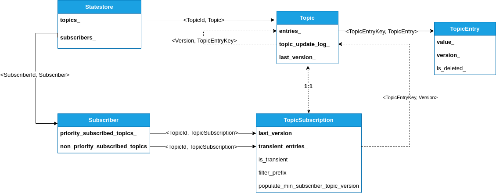

# Impala开发笔记

## 模块组件

- Frontend:
  - Lexer, Parser, Analyzer, Planner
  - 资源预估
- Backend:
  - UDF Executor
  - Join Executor
  - Exchange
  - Admission Controller
  - Thrift Server
- Statestored, Catalogd, Impalad
- Test:  MiniCluster，FE Test, BE Test, EE Test，TPC-DS Test，TPC-H Test，Data Generator
- QuickStart：Docker
- Client

## 编译构建

### 先决条件

硬件要求：

- CPU 必须至少支持 SSSE3
- 最小内存：16GB
- 硬盘空间：120GB（用于测试数据）

支持的操作系统包括：

- Ubuntu 14.04, 16.04, 18.04
- CentOS 7

### 全量构建

```shell
# cd ~/Impala
bash bin/bootstrap_system.sh
source bin/impala-config.sh
buildall.sh -release -notests
```

- 如果要跳过构建BE测试，将 `-notests` 传递给 buildall.sh 命令
- 如果不需要完全清理，则将 `-noclean` 传递给 buildall.sh 命令

#### 参考

[Building Impala](https://cwiki.apache.org/confluence/display/IMPALA/Building+Impala)

### 增量构建

```shell
# 重新生成cmake文件
./buildall.sh -cmake_only

# 重新构建impalad二进制文件
make -j ${IMPALA_BUILD_THREADS} impalad

# 重新构建java侧的fe
make -j ${IMPALA_BUILD_THREADS} java

# 仅重新构建一个BE测试二进制
make -j ${IMPALA_BUILD_THREADS} buffered-block-mgr-test
 
# 仅重新构建 FE
make fe
```

可以使用ninja加速增量构建：

```shell
# 安装 ninja
sudo apt-get install ninja-build
 
# 代替命令 ./buildall.sh ...:
./buildall.sh ... -ninja
 
# 代替命令  make -j ${IMPALA_BUILD_THREADS} <targets>:
ninja -j ${IMPALA_BUILD_THREADS} <targets>
 
# 使用alias以指定ninja构建线程数
alias ninja='ninja -j ${IMPALA_BUILD_THREADS}'
```

使用distcc，参考：https://github.com/apache/impala/blob/4.0.0/bin/distcc/README.md

跳过检查toolchain依赖项：

```shell
echo "export SKIP_TOOLCHAIN_BOOTSTRAP=true" >> bin/impala-config-local.sh
```

#### 参考

[Tips for Faster Impala Builds](https://cwiki.apache.org/confluence/display/IMPALA/Tips+for+Faster+Impala+Builds)

### 国内镜像加速

编译Impala源码的时候会下载大量的依赖包，由于大部分地址在国内的访问速度堪忧，给国内开发者增加了门槛。现提供一个非官方的镜像地址及相应配置方式，适用于Impala 4.0.0以上，仅供参考。

注：由于服务端限制单个文件不超过 500MB，需要对某些包做裁剪（软链接重复文件），裁剪情况如下：

| 版本  | c++依赖包（ToolchainPackage） | cluster组件（CdpComponent） |
| ----- | ----------------------------- | --------------------------- |
| 4.0.0 | 裁剪了kudu                    | 完整                        |
| 4.1.0 | 裁剪了kudu                    | 裁剪ranger                  |

编译Impala时会下载的依赖主要包括4个部分：

1. 预置的 maven jar包
2. python包
3. maven jar 包
4. toolchain包

其中：

第 1 部分不是必须的，4.2.0以下可以在bootstrap_system.sh脚本中注释掉，参考：[IMPALA-11439](http://issues.apache.org/jira/browse/IMPALA-11439)。4.2.0以上在初始化的时候通过环境变量跳过：

```shell
# 不下载预置maven包
export PREPOPULATE_M2_REPOSITORY=false
# 初始化编译环境
${IMPALA_HOME}/bin/bootstrap_system.sh
```

第 2 部分可以通过配置PYPI的国内镜像地址（4.1.0以下需要打个 patch：[IMPALA-10994](http://issues.apache.org/jira/browse/IMPALA-10994)）来加速，如：

```shell
export PYPI_MIRROR=https://pypi.tuna.tsinghua.edu.cn
```

通过下面命令单独下载python包：

```shell
${IMPALA_HOME}/infra/python/deps/download_requirements
```

第 3 部分：配置~/.m2/settings.xml如下（变量repoId，username，password请在“图解代码”公众号发送关键字“Impala镜像”获取）：

```xml
<?xml version="1.0" encoding="UTF-8"?>
<settings xsi:schemaLocation="http://maven.apache.org/SETTINGS/1.0.0 http://maven.apache.org/xsd/settings-1.0.0.xsd"
          xmlns="http://maven.apache.org/SETTINGS/1.0.0"
          xmlns:xsi="http://www.w3.org/2001/XMLSchema-instance">
    <servers>
        <server>
            <id>rdc-releases</id>
            <username>${username}</username>
            <password>${password}</password>
        </server>
    </servers>
    <mirrors>
        <mirror>
            <id>aliyunmaven</id>
            <mirrorOf>central</mirrorOf>
            <url>https://maven.aliyun.com/repository/public</url>
        </mirror>
        <mirror>
            <id>rdc-releases</id>
            <mirrorOf>*,!central</mirrorOf>
            <url>https://packages.aliyun.com/maven/repository/${repoId}</url>
        </mirror>
    </mirrors>
</settings>
```

之后再运行 mvn 命令的时候就能使用镜像地址进行加速了。

第 4 部分：写入~/.netrc文件（变量username，password的获取参考第 3 部分）：

```
machine packages.aliyun.com login ${username} password ${password}
```

运行以下命令下载 toolchain（变量repoId的获取参考第 3 部分）：

```shell
# 禁止重复下载python包
export SKIP_PYTHON_DOWNLOAD=true
# 下载minicluster依赖的组件
export DOWNLOAD_CDH_COMPONENTS=true
# 下载c++的依赖包
export SKIP_TOOLCHAIN_BOOTSTRAP=false

export IMPALA_TOOLCHAIN_HOST=packages.aliyun.com/maven/repository/${repoId}
export IMPALA_HADOOP_URL='https://${toolchain_host}/build/hadoop/${version}/hadoop-${version}.tar.gz'
export IMPALA_HBASE_URL='https://${toolchain_host}/build/hbase/${version}/hbase-${version}-bin.tar.gz'
export IMPALA_HIVE_URL='https://${toolchain_host}/build/apache-hive/${version}/apache-hive-${version}-bin.tar.gz'
export IMPALA_HIVE_SOURCE_URL='https://${toolchain_host}/build/hive/${version}/hive-${version}-source.tar.gz'
export IMPALA_RANGER_URL='https://${toolchain_host}/build/ranger/${version}/ranger-${version}-admin.tar.gz'
export IMPALA_TEZ_URL='https://${toolchain_host}/build/tez/${version}/tez-${version}-minimal.tar.gz'

# 执行下载动作
${IMPALA_HOME}/bin/bootstrap_toolchain.py
```

### buildall.sh详细用法

主要作用是编译代码，启动impala依赖的minicluster集群（包括HDFS，Hive，HBase，Kudu等），启动Impala集群（包括catalogd, statestored, impalad），加载测试元数据及数据，执行测试。

参数说明：

| 参数                                                         | 内部变量                                                     | 默认值                                    | 说明                                                         |
| ------------------------------------------------------------ | ------------------------------------------------------------ | ----------------------------------------- | ------------------------------------------------------------ |
| -noclean                                                     | CLEAN_ACTION                                                 | False                                     | 不清理编译输出目录。                                         |
| -format                                                      | FORMAT_CLUSTER, <br />FORMAT_METASTORE,<br />FORMAT_RANGER_POLICY_DB | False                                     | 格式化 minicluster, metastore db, 和 ranger policy db        |
| -format_cluster                                              | FORMAT_CLUSTER                                               | False                                     | 格式化 minicluster                                           |
| -format_metastore                                            | FORMAT_METASTORE                                             | False                                     | 格式化 metastore db                                          |
| -format_ranger_policy_db                                     | FORMAT_RANGER_POLICY_DB                                      | False                                     | 格式化 Ranger policy db                                      |
| -upgrade_metastore_db                                        | UPGRADE_METASTORE_SCHEMA                                     | False                                     | 升级metastore db的schema                                     |
| -release_and_debug                                           | BUILD_RELEASE_AND_DEBUG                                      | false                                     | 同时构建 release 和 debug 二进制文件. 覆盖其他的构建类型     |
| -release                                                     | CMAKE_BUILD_TYPE                                             | debug                                     | 构建Release                                                  |
| -codecoverage                                                | CODE_COVERAGE                                                | False                                     | Build with code coverage                                     |
| -asan                                                        | BUILD_ASAN                                                   | False                                     | 构建Address sanitizer                                        |
| -tidy                                                        | BUILD_TIDY                                                   | False                                     | 构建clang-tidy                                               |
| -tsan                                                        | BUILD_TSAN                                                   | False                                     | 构建Thread sanitizer, 和参数 ignore_noninstrumented_modules=1一起运行. 当此flag是 true, TSAN 忽略从 non-instrumented libraries的内存访问. 这降低了假阳性数量, 但会漏掉真正的问题. -full_tsan参数会禁用此 flag |
| -full_tsan                                                   | BUILD_TSAN_FULL                                              | False                                     | 构建Thread sanitizer, 和参数 ignore_noninstrumented_modules=0 一起运行(看-tsan 的描述阐述了这个flag做了什么) |
| -ubsan                                                       | BUILD_UBSAN                                                  | False                                     | 构建Undefined behavior sanitizer                             |
| -full_ubsan                                                  | BUILD_UBSAN_FULL                                             | False                                     | 构建Undefined behavior sanitizer, 包交叉编译生成的 LLVM IR代码. 比单纯的-ubsan查询更慢 |
| -skiptests                                                   | TESTS_ACTION                                                 | False                                     | 跳过执行所有的测试                                           |
| -notests                                                     | BUILD_TESTS, TESTS_ACTION                                    | False                                     | 跳过构建和执行所有的测试                                     |
| -start_minicluster                                           | NEED_MINICLUSTER                                             | 如果运行测试或加载数据为True，否则为False | 启动测试集群，包括Impala和它依赖的集群。如果已经在运行，所有服务都会重启，重新生成 test cluster 配置文件 |
| -start_impala_cluster                                        | START_IMPALA_CLUSTER                                         | False                                     | 在构建完成后启动 Impala minicluster                          |
| -testpairwise                                                | EXPLORATION_STRATEGY                                         | ore                                       | 以'pairwise' 模式运行测试 (会增加测试执行时间)               |
| -testexhaustive                                              | EXPLORATION_STRATEGY                                         | core                                      | 以 'exhaustive' 模式运行测试, 会显著增加测试执行时间.仅应用于workload套件：functional-query, targeted-stress |
| -testdata                                                    | TESTDATA_ACTION                                              | False                                     | 加载测试数据. 如果指定了-snapshot_file 默认为True. 如果-snapshot_file没有指定, 数据会被重新生成。 |
| -snapshot_file \<file name>                                  | SNAPSHOT_FILE                                                | -                                         | 从一个snapshot file加载测试数据                              |
| -metastore_snapshot_file <file_name>: Load the hive metastore snapshot | METASTORE_SNAPSHOT_FILE                                      | -                                         | 加载Hive metastore 快照                                      |
| -so\|-build_shared_libs                                      | BUILD_SHARED_LIBS                                            | static                                    | 动态连接可执行文件                                           |
| -fe_only                                                     | BUILD_FE_ONLY                                                | 0                                         | 仅构建fe                                                     |
| -ninja                                                       | MAKE_CMD                                                     |                                           | 使用 ninja 替代 make                                         |
| -cmake_only                                                  | GEN_CMAKE_ONLY                                               | 0                                         | 仅生成 makefiles, 而不是执行全量构建                         |
| -v\|-debug                                                   | -                                                            | -                                         | 使用调试模式执行shell脚本                                    |

外部环境变量：

| 变量名                   | 候选值                     | 默认值              | 说明                                                         |
| ------------------------ | -------------------------- | ------------------- | ------------------------------------------------------------ |
| CMAKE_BUILD_TYPE         | Debug, Release             | Debug               | 编译Debug版还是Release版，可以通过命令行参数`-release`覆盖   |
| DOWNLOAD_CDH_COMPONENTS  | true,false                 | 无                  | 控制是否下载toolchain的开关之一                              |
| EXPLORATION_STRATEGY     | core, pairwise, exhaustive | core                | 运行测试的模式，可以通过命令行参数`-testpairwise` 或 `testexhaustive`覆盖 |
| IMPALA_ALL_LOGS_DIRS     | 任意                       | 无                  | impala所有日志根目录                                         |
| IMPALA_BUILD_THREADS     | 任意                       | 4                   | 编译线程数                                                   |
| IMPALA_HOME              | 任意                       | 无                  | impala源码目录                                               |
| IMPALA_MAKE_FLAGS        | 任意                       | 无                  | make命令flags                                                |
| SKIP_PYTHON_DOWNLOAD     | true, false                | 无                  | 不下载python依赖库                                           |
| SKIP_TOOLCHAIN_BOOTSTRAP | true, false                | 无                  | 控制是否下载toolchain的开关之一                              |
| TARGET_FILESYSTEM        | hdfs,s3,local              | dfs                 | 加载测试数据的文件系统                                       |
| CDP_FILE                 | -                          | ${IMPALA_HOME}/.cdp | 内容为$CDP_BUILD_NUMBER                                      |

常见用例：

```shell
# 构建并运行所有测试
./buildall.sh

# 构建并跳过测试
./buildall.sh -skiptests

# 构建,然后刷新配置重启minicluster和Impala
./buildall.sh -notests -start_minicluster -start_impala_cluster

# 增量构建并跳过测试.保持现有的minicluster服务运行并重启Impala
./buildall.sh -skiptests -noclean -start_impala_cluster

# 构建,加载一个snapshot文件, 运行测试
./buildall.sh -snapshot_file <file>

# 构建,加载hive metastore和hdfs snapshot, 运行测试
./buildall.sh -snapshot_file <file> -metastore_snapshot_file <file>

# 构建,生成,和增量加载测试数据，并且不格式化mini-cluster (重用HDFS上已存在的数据). 比从snapshot加载更快
./buildall.sh -testdata

# 构建, 格式化mini-cluster和metastore,加载所有测试数据,运行测试
./buildall.sh -testdata -format

# 构建并升级metastore schema至最新版.
./buildall.sh -upgrade_metastore_db
```

### 组件默认端口

| 组件            | 端口              | 描述           |
| --------------- | ----------------- | -------------- |
| KMS             | 9600              | Web UI 端口    |
| NameNode        | 5070              | Web UI 端口    |
| NameNode        | 20500             | 服务端口       |
| ResourceManager | 8088              | Web UI 端口    |
| PostgreSQL      | 5432              | 服务端口       |
| HiveServer2     | 10001             | HTTP JDBC 端口 |
| HiveServer2     | 10002             |                |
| HiveServer2     | 11050             | JDBC端口       |
| HiveServer2     | 30020             | JVM调试端口    |
| HiveMetaStore   | 9083              | 服务端口       |
| HiveMetaStore   | 30010             | JVM调试端口    |
| Ranger          | 6080              | Web UI 端口    |
| Ranger          | 6085              |                |
| Ranger          | 30130             | JVM调试端口    |
| HRegionServer   | 16030,16032,16033 | Web UI 端口    |
| ZooKeeper       | 2181              | 服务端口       |
| ZooKeeper       | 8080              |                |
| kudu master     | 7051              | 服务端口       |
| kudu master     | 8051              | Web UI 端口    |

#### 参考

[Ranger service ports](https://docs.cloudera.com/HDPDocuments/HDP3/HDP-3.1.0/administration/content/ranger-ports.html)

### 编译时间优化

#### 编译展开分析

在cmake中指定编译选型"-save-temps"保留编译中间文件：

```cmake
# be/CMakeLists.txt
set(CMAKE_CXX_FLAGS "${CMAKE_CXX_FLAGS} -save-temps")
```

#### 头文件依赖分析

通过工具统计出编译源文件直接和间接依赖的头文件的总个数。

#### 编译耗时统计

从结果上看各个文件的编译耗时以及各个编译阶段的耗时情况，正常情况下，是和文件展开大小以及头文件引用个数是正相关的。

cmake通过指定环境变量能打印出编译和链接阶段的耗时情况：

```cmake
# export IMPALA_BUILD_THREADS=1
# be/CMakeLists.txt
set_property(GLOBAL PROPERTY RULE_LAUNCH_COMPILE "${CMAKE_COMMAND} -E time")
set_property(GLOBAL PROPERTY RULE_LAUNCH_LINK "${CMAKE_COMMAND} -E time")
```

#### 参考

[C++服务编译耗时优化原理及实践](https://tech.meituan.com/2020/12/10/apache-kylin-practice-in-meituan.html)

## IDE配置

### VSCode配置

#### 配置clangd lsp server

1. centos7的glibc版本比较旧，clangd依赖新版本的glibc，需要先下载glibc-2.18：

   ```
   wget --no-check-certificate https://mirrors.tuna.tsinghua.edu.cn/gnu/glibc/glibc-2.18.tar.gz
   ```

2. 解压glibc压缩包：

   ```
   tar -zxvf glibc-2.18.tar.gz
   ```

3. 编译并安装glibc：

   ```
   cd glibc-2.18
   mkdir build
   cd build/
   sudo ../configure --prefix=/usr --disable-profile --enable-add-ons --with-headers=/usr/include --with-binutils=/usr/bin
   sudo make -j 8
   sudo make install
   ```

4. 在Server 端下载clangd-linux-13.0.0.zip文件，并解压到目录 /opt/impala/clangd：

   ```
   wget https://github.com/clangd/clangd/releases/download/13.0.0/clangd-linux-13.0.0.zip
   jar xvf clangd-linux-13.0.0.zip
   mv clangd_13.0.0 /opt/impala/clangd
   chmod a+x /opt/impala/clangd/bin/clangd
   ```

5. 安装clangd插件，并配置clangd命令路径

## 代码调试

### 参考

[Impala Debugging Tips](https://cwiki.apache.org/confluence/display/IMPALA/Impala+Debugging+Tips)

## 源码分析

以下代码以[4.0.0源码](https://github.com/apache/impala/blob/4.0.0)为例。

### 术语表

| 术语        | 说明                                       |
| ----------- | ------------------------------------------ |
| lhs, rhs    | Left-side-hand, right-side-hand缩写        |
| c'tor       | constructor缩写                            |
| localViews_ | a view definition in this analyzer's scope |
|             |                                            |
|             |                                            |
|             |                                            |
|             |                                            |

### bootstrap_system.sh

为开发环境做些准备，大体执行流程：

- 设置环境变量 IMPALA_HOME
- 如果是交互模式，询问是否愿意更改环境配置，是则继续，否则退出；如果不是交互模式，直接执行。
- 判断Linux发行版版本（REDHAT6，REDHAT7，UBUNTU16.04），以及是否在Docker内
- 安装一堆软件包，包括编译相关工具，kerberos，postgresql等
- 下载apache-ant-1.9.14和apache-maven-3.5.4并安装到目录`/usr/local`下
- 启动ssh服务
- 初始化postgresql并启动
- 为HMS创建账号，用户名：hiveuser，密码：password
- 配置到localhost的免密登录
- 配置`/etc/hosts`
- 创建目录：`/var/lib/hadoop-hdfs`
- 配置系统最大打开文件数为1048576，最大进程数为unlimited
- 如果IMPALA_HOME目录不存在，则checkout Impala源码，并导出环境变量 IMPALA_HOME到`~/.bashrc`
- 配置JAVA_HOME，并固化到`bin/impala-config-local.sh`
- 下载maven软件包到本地仓库

在Docker里运行此脚本需要做的准备：

```shell
# 添加参数--privileged
docker run --privileged --cap-add SYS_TIME -d -it --name impala_build ubuntu:16.04 bash
# 赋予容器一个非root无需密码的sudoer：
apt-get update
apt-get install sudo
adduser --disabled-password --gecos '' impdev
echo 'impdev ALL=(ALL) NOPASSWD:ALL' >> /etc/sudoers

# 使用新建的用户运行：
su - impdev -c bin/bootstrap_development.sh
```

### buildall.sh

编译前的准备步骤包括：

- [第55行至85行](https://github.com/apache/impala/blob/4.0.0/buildall.sh#L55,L85) 设置内部变量的默认值。
- [第88行至286行](https://github.com/apache/impala/blob/4.0.0/buildall.sh#L88,L286)解析命令行参数并设置内部变量。

- [第344行至349行](https://github.com/apache/impala/blob/4.0.0/buildall.sh#L344,L349)校验启用kerberos的集群上不支持运行测试或者加载测试数据。

- [第351行至356行](https://github.com/apache/impala/blob/4.0.0/buildall.sh#L351,L356)校验加载测试数据的hive元数据快照仅支持hdfs文件系统。

- [第575行至578行](https://github.com/apache/impala/blob/4.0.0/buildall.sh#L575)调用脚本`bin/clean.sh`清理之前的构建目录。
- 在函数[`create_log_dirs()`](https://github.com/apache/impala/blob/4.0.0/buildall.sh#L365,L380)中创建统一的日志目录。
- 在函数[`bootstrap_dependencies()`](https://github.com/apache/impala/blob/4.0.0/buildall.sh#L382,L422)，中下载python依赖和toolchain：
  - 如果`SKIP_PYTHON_DOWNLOAD=false`则执行脚本`infra/python/deps/download_requirements`下载python的依赖。
  - 如果`SKIP_TOOLCHAIN_BOOTSTRAP=true`且`DOWNLOAD_CDH_COMPONENTS=true`，或者`SKIP_TOOLCHAIN_BOOTSTRAP=false`，则执行脚本`bin/bootstrap_toolchain.py`下载toolchain。

编译过程首先调用cmake命令生成Makefile，即函数[`generate_cmake_files()`](https://github.com/apache/impala/blob/4.0.0/buildall.sh#L460,L501)，cmake的参数包括：`-DCMAKE_BUILD_TYPE`，`-DBUILD_SHARED_LIBS`，`-GNinja`，`-DCMAKE_TOOLCHAIN_FILE`，`-DCACHELINESIZE_AARCH64` 。不同构建需求的区别主要在于参数`CMAKE_BUILD_TYPE`的不同，它的默认值是`Debug`，除了默认值之外还有9种互斥的情况：

- `CODE_COVERAGE_DEBUG`，由参数`-codecoverage`和`-release`确定。
- `CODE_COVERAGE_RELEASE`，由参数`-codecoverage`和`-release`确定。
- `RELEASE`，由参数`-release`确定。
- `ADDRESS_SANITIZER`，由参数`-asan`确定。
- `TIDY`，由参数`-tidy`确定。
- `UBSAN`，由参数`-ubsan`确定。
- `UBSAN_FULL`，由参数`-full_ubsan`确定。
- `TSAN`，由参数`-tsan`确定。
- `TSAN_FULL`，由参数`-full_tsan`确定。

如果指定了参数`-cmake_only`则仅会根据参数`CMAKE_BUILD_TYPE`生成Makefile。

如果指定了参数`-fe_only`则在生成Makefile之后仅编译`FE`部分。

如果以上两个参数都没有指定，则会调用函数[`build_all_components()`](https://github.com/apache/impala/blob/4.0.0/buildall.sh#L435,L455)构建所有组件（包括FE和BE等）。

- 如果指定了参数`-release_and_debug`，则会依次生成RELEASE和DEBUG类型的Makefile；否则根据参数确定的`CMAKE_BUILD_TYPE`来生成Makefile。

- 然后调用`make`命令执行编译过程，make命令的目标有三种情况：

| 编译测试文件 | 是否编译不相关目标 | MAKE目标                |
| ------------ | ------------------ | ----------------------- |
| False        | True               | notests_all_targets     |
| False        | False              | notests_regular_targets |
| True         | 任意               | （空）                  |

接下来是minicluster相关，[第506行至534行](https://github.com/apache/impala/blob/4.0.0/buildall.sh#L506,L534)定义了函数`reconfigure_test_cluster()`，主要作用是调用`bin/create-test-configuration.sh`脚本生成impala依赖的hadoop配置文件，同时还会执行格式化元数据相关操作（会先kill掉minicluster集群）：

- `-format_cluster`的操作最终是删除了hdfs和kudu的数据目录：

  [buildall.sh](https://github.com/apache/impala/blob/4.0.0/buildall.sh#L542) => [testdata/bin/run-all.sh](https://github.com/apache/impala/blob/4.0.0/testdata/bin/run-all.sh#L54) => [testdata/bin/run-mini-dfs.sh](https://github.com/apache/impala/blob/4.0.0/testdata/bin/run-mini-dfs.sh#L38) => [testdata/cluster/admin](https://github.com/apache/impala/blob/4.0.0/testdata/cluster/admin#L459,L463)

- `-format_metastore`操作最终在pg数据库里删除重建了metastore的db，并执行`schematool -initSchema`命令：

  [buildall.sh](https://github.com/apache/impala/blob/4.0.0/buildall.sh#L533) => [bin/create-test-configuration.sh](https://github.com/apache/impala/blob/4.0.0/bin/create-test-configuration.sh#L162,L165)

- `-format_ranger_policy_db`的操作同样删除重建了Ranger Policy的db，并在`RANGER_HOME`目录下生成`install.properties`配置文件，并执行`db_setup.py`：

  [buildall.sh](https://github.com/apache/impala/blob/4.0.0/buildall.sh#L533) => [bin/create-test-configuration.sh](https://github.com/apache/impala/blob/4.0.0/bin/create-test-configuration.sh#L185,L193)

- `-upgrade_metastore_db`最终是执行`schematool -upgradeSchema`命令：

  [buildall.sh](https://github.com/apache/impala/blob/4.0.0/buildall.sh#L533) => [bin/create-test-configuration.sh](https://github.com/apache/impala/blob/4.0.0/bin/create-test-configuration.sh#L181)

如果指定了参数`-metastore_snapshot_file`，则调用脚本[`testdata/bin/load-metastore-snapshot.sh`](https://github.com/apache/impala/blob/4.0.0/buildall.sh#L620,L623)加载Hive metastore的元数据。

[第537行至543行](https://github.com/apache/impala/blob/4.0.0/buildall.sh#L537,L543)定义了函数`start_test_cluster_dependencies()`，主要是调用脚本`testdata/bin/run-all.sh`启动minicluster集群。

在minicluster集群启动之后，[第548行至565行](https://github.com/apache/impala/blob/4.0.0/buildall.sh#L548,L565)定义了函数`load_test_data()`，用来执行数据加载步骤：

- 执行脚本`$IMPALA_HOME/bin/create_testdata.sh`

- 执行脚本`${IMPALA_HOME}/testdata/bin/create-load-data.sh`。根据变量`SNAPSHOT_FILE` 和变量`METASTORE_SNAPSHOT_FILE`的值是否为空，传递的参数有4种组合情况：

  | SNAPSHOT_FILE | METASTORE_SNAPSHOT_FILE | CREATE_LOAD_DATA_ARGS                   |
  | ------------- | ----------------------- | --------------------------------------- |
  | 不为空        | 不为空                  | -snapshot_file, -skip_metadata_load     |
  | 不为空        | 空                      | -snapshot_file                          |
  | 空            | 不为空                  | -skip_metadata_load -skip_snapshot_load |
  | 空            | 空                      | 空                                      |

在数据加载完成之后，[第567行至573行](https://github.com/apache/impala/blob/4.0.0/buildall.sh#L567,L573)定义了函数`run_all_tests()`，调用脚本`bin/run-all-tests.sh`运行测试。

### report_build_error.sh

setup_report_build_error函数功能：如果接收到错误，打印行号。

### clean.sh

清理编译输出目录，包括：

- 扩展数据源输出目录
- fe输出目录
- be输出目录
- shell输出目录
- python中间文件和目录
- llvm输出目录
- cmake生成文件

### download_requirements

替代pip命令从PyPI源下载python包，可以通过环境变量`PYPI_MIRROR`设置PyPI源镜像地址，下载的python包列表在`infra/python/deps/requirements.txt`等文件中指定。

至于为什么不用pip命令下载，注释说的意思是不同操作系统下载不稳定和不一致（Impala也只支持Linux啊，感觉站不住脚），还有避免执行可能会失败的某些包的setup.py，参考：[IMPALA-3778](http://issues.apache.org/jira/browse/IMPALA-3778)。

### bootstrap_toolchain.py

### create-test-configuration.sh

使用说明：

```
[-create_metastore] : If true, creates a new metastore.
[-create_ranger_policy_db] : If true, creates a new Ranger policy db.
[-upgrade_metastore_db] : If true, upgrades the schema of HMS db.
```

### load-metastore-snapshot.sh

### create_testdata.sh

### create-load-data.sh

### run-all.sh

### run-mini-dfs.sh

### run-all-tests.sh

### CMakeLists.txt

`cmake_minimum_required`指定了 CMake 版本。

`set(NO_TESTS 1)`禁掉kudu 的一些测试的 target。

| 变量                          | 类型 | 描述                                                         |
| ----------------------------- | ---- | ------------------------------------------------------------ |
| NO_TESTS                      |      |                                                              |
| BUILD_SHARED_LIBS             |      | 全局flag，控制add_library()默认创建 shared 库                |
| IMPALA_BUILD_SHARED_LIBS      |      |                                                              |
| CMAKE_EXPORT_COMPILE_COMMANDS |      | 生成compile_commands.json                                    |
| CMAKE_MODULE_PATH             | 内置 | cmake modules加载的目录，分号分隔                            |
| CMAKE_BUILD_TYPE              |      | 指定构建类型，如Debug`, `Release`, `RelWithDebInfo`, `MinSizeRel...大小写敏感 |
| Boost_NO_BOOST_CMAKE          |      | 禁用boost-cmake                                              |
| Boost_USE_STATIC_LIBS         |      |                                                              |
| Boost_USE_STATIC_RUNTIME      |      |                                                              |
| Boost_USE_MULTITHREADED       |      |                                                              |
| Boost_NO_SYSTEM_PATHS         |      |                                                              |
| BOOST_LIBRARYDIR              |      |                                                              |
| BOOST_INCLUDEDIR              |      |                                                              |
| Boost_INCLUDE_DIR             |      |                                                              |
| Boost_DEBUG                   |      |                                                              |
| CMAKE_DEBUG                   |      |                                                              |
| CMAKE_SYSTEM_PROCESSOR        |      |                                                              |
|                               |      |                                                              |
|                               |      |                                                              |
|                               |      |                                                              |
|                               |      |                                                              |
|                               |      |                                                              |
|                               |      |                                                              |
|                               |      |                                                              |
|                               |      |                                                              |
|                               |      |                                                              |
|                               |      |                                                              |
|                               |      |                                                              |
|                               |      |                                                              |
|                               |      |                                                              |
|                               |      |                                                              |
|                               |      |                                                              |
|                               |      |                                                              |


### Frontend

impalad服务端接收请求入口：`impala-beeswax-server.cc#ImpalaServer::query()`

Frontend.cc#Frontend::GetExecRequest() 通过JNI接口调用

org.apache.impala.planner.Planner.createPlan()

#### org.apache.impala.planner.PlanNode

slot, materialized, conjuncts,

#### org.apache.impala.planner.PlanNodeId

#### org.apache.impala.analysis.TupleDescriptor


#### org.apache.impala.catalog.FeView

LocalView

=======

#### 类型系统

##### org.apache.impala.catalog.PrimitiveType

为什么有了对应的thrift类还要有PrimitiveType？

org.apache.impala.catalog.Type

org.apache.impala.catalog.ScalarType

#### SQL解析

##### org.apache.impala.analysis.StatementBase

子类：

| 类名                                | 抽象类 | 说明 |
| ----------------------------------- | ------ | ---- |
| QueryStmt                           | T      |      |
| ModifyStmt                          | T      |      |
| AlterDbStmt                         | T      |      |
| AlterTableStmt                      | T      |      |
| AlterTableSetColumnStats            | T      |      |
| AlterTableOrViewSetOwnerStmt        | T      |      |
| CommentOnStmt                       | T      |      |
| CommentOnTableOrViewStmt            | T      |      |
| CreateFunctionStmtBase              | T      |      |
| CreateOrAlterViewStmtBase           | T      |      |
| AdminFnStmt                         |        |      |
| AlterDbSetOwnerStmt                 |        |      |
| AlterTableAddColsStmt               |        |      |
| AlterTableAddDropRangePartitionStmt |        |      |
| AlterTableAddPartitionStmt          |        |      |
| AlterTableAlterColStmt              |        |      |
| AlterTableDropColStmt               |        |      |
| AlterTableDropPartitionStmt         |        |      |
| AlterTableOrViewRenameStmt          |        |      |
| AlterTableRecoverPartitionsStmt     |        |      |
| AlterTableReplaceColsStmt           |        |      |
| AlterTableSetCachedStmt             |        |      |
| AlterTableSetFileFormatStmt         |        |      |
| AlterTableSetLocationStmt           |        |      |
| AlterTableSetOwnerStmt              |        |      |
| AlterTableSetRowFormatStmt          |        |      |
| AlterTableSetStmt                   |        |      |
| AlterTableSetTblProperties          |        |      |
| AlterTableSortByStmt                |        |      |
| AlterViewSetOwnerStmt               |        |      |
| AlterViewStmt                       |        |      |
| AuthorizationStmt                   |        |      |
| CommentOnColumnStmt                 |        |      |
| CommentOnDbStmt                     |        |      |
| CommentOnTableStmt                  |        |      |
| CommentOnViewStmt                   |        |      |
| ComputeStatsStmt                    |        |      |
| CopyTestCaseStmt                    |        |      |
| CreateDataSrcStmt                   |        |      |
| CreateDbStmt                        |        |      |
| CreateDropRoleStmt                  |        |      |
| CreateTableAsSelectStmt             |        |      |
| CreateTableDataSrcStmt              |        |      |
| CreateTableLikeFileStmt             |        |      |
| CreateTableLikeStmt                 |        |      |
| CreateTableStmt                     |        |      |
| CreateUdaStmt                       |        |      |
| CreateUdfStmt                       |        |      |
| CreateUdtStmt                       |        |      |
| CreateViewStmt                      |        |      |
| DeleteStmt                          |        |      |
| DescribeDbStmt                      |        |      |
| DescribeTableStmt                   |        |      |
| DropDataSrcStmt                     |        |      |
| DropDbStmt                          |        |      |
| DropFunctionStmt                    |        |      |
| DropStatsStmt                       |        |      |
| DropTableOrViewStmt                 |        |      |
| GrantRevokePrivStmt                 |        |      |
| GrantRevokeRoleStmt                 |        |      |
| InsertStmt                          |        |      |
| LoadDataStmt                        |        |      |
| ResetMetadataStmt                   |        |      |
| SelectStmt                          |        |      |
| SetStmt                             |        |      |
| ShowCreateFunctionStmt              |        |      |
| ShowCreateTableStmt                 |        |      |
| ShowDataSrcsStmt                    |        |      |
| ShowDbsStmt                         |        |      |
| ShowFilesStmt                       |        |      |
| ShowFunctionsStmt                   |        |      |
| ShowGrantPrincipalStmt              |        |      |
| ShowRolesStmt                       |        |      |
| ShowStatsStmt                       |        |      |
| ShowTablesStmt                      |        |      |
| TruncateStmt                        |        |      |
| UnionStmt                           |        |      |
| UpdateStmt                          |        |      |
| UseStmt                             |        |      |
| ValuesStmt                          |        |      |

### Backend

#### be/src/rpc/TAcceptQueueServer.cc

Impala中所有Thrift Server处理连接的逻辑都在这个类里，包括HiverServer2 Server，Beeswax Server等。

在TAcceptQueueServer构造函数中进行一些初始化：

| 参数                | 描述                                 |
| ------------------- | ------------------------------------ |
| processor           | Thrift框架相关                       |
| serverTransport     | Thrift框架相关                       |
| transportFactory    | Thrift框架相关                       |
| protocolFactory     | Thrift框架相关                       |
| threadFactory       | 用于创建task线程                     |
| name                | 服务名                               |
| maxTasks            | 处理连接逻辑的最大task数             |
| queue_timeout_ms    | 在accept之后，建立task之前的超时时间 |
| idle_poll_period_ms | 等待客户端socket超时的时间           |

Thrift Server的启动和接受请求以及停止逻辑都在TAcceptQueueServer::serve()中：

1. 启动端口监听
2. 创建用于accept请求的线程池connection_setup_pool，并调用Init()方法进行初始化。
3. 当没有stop时，在循环中执行：
   1. 接受一个client的请求，并封装为TAcceptQueueEntry
   2. 调用connection_setup_pool.Offer()入队
4. 当stop时，关闭serverTransport_和连接池connection_setup_pool，等待tasks队列中所有任务执行完毕。

一个客户端请求被accept之后，主流程就会启动一个服务线程异步地处理客户端的请求，主要逻辑在TAcceptQueueServer::SetupConnection()中：

1. 创建TAcceptQueueServer::Task，并创建一个对应的线程
2. 当task数量超过maxTasks限制时，出让时间片等待；如果等待超时则清理资源并退出。
3. 当task数量没有超过maxTasks限制，或者提前被唤醒时，则将task加入tasks列表，并启动线程。

服务线程的的主要逻辑在TAcceptQueueServer::Task::run()中：

1. 调用eventHandler->processContext()处理上下文
2. 处理客户端的请求，或者调用peek()阻塞等待客户端的请求

可以看出这个类里主要有两个线程池/线程集：

| 名称       | connection_setup_pool                                       | maxTasks             |
| ---------- | ----------------------------------------------------------- | -------------------- |
| 描述       | 负责接受请求并分配服务线程                                  | 负责处理客户端的请求 |
| 线程最大数 | 由FLAGS_accepted_cnxn_setup_thread_pool_size设置，默认值是2 | 由构造函数参数传入   |
| 队列长度   | 由FLAGS_accepted_cnxn_queue_depth设置，默认值是10000        | 无限制               |

Impala之所以要自定义一个TServer，就是想将accept线程和setupConnection线程解耦，从而提高accept的吞吐量。FLAGS_accepted_cnxn_queue_depth默认值是10000，也解释了21050端口的连接数量超过fe_service_thread后为什么会阻塞而不会报错的原因。

其中还记录了一些metric：

| 名称                        | 类型      | key                            | 描述                          |
| --------------------------- | --------- | ------------------------------ | ----------------------------- |
| queue_size_metric_          | Gauge     | ".connection-setup-queue-size" | connection_setup_pool队列大小 |
| timedout_cnxns_metric_      | Gauge     | ".timedout-cnxn-requests"      | 建立连接超时的请求数量        |
| cnxns_setup_time_us_metric_ | Histogram | ".connection-setup-time"       | 建立连接的时间统计            |
| thread_wait_time_us_metric_ | Histogram | ".svc-thread-wait-time"        | 建立连接到处理请求的时间统计  |

参考：[IMPALA-4135](https://issues.apache.org/jira/browse/IMPALA-4135)

#### be/src/statestore/statestore.cc

#### be/src/statestore/statestore-subscriber.cc

 `Statestored`类似于一个在内存中维护着一组 `Topic`的消息队列，但是和常见消息队列的客户端有`Producer`和`Consumer`不同的是，它的客户端只有一个`Subscriber`角色。

如下图所示，`Subscriber`通过交换`Topic`更新消息定期与`Statestored`通信：`Subscriber`首先向`Statestored`d注册`Topic`，`Statestored`向`Subscriber`发送其订阅的`Topic`列表的更新，`Subscriber`返回`Topic`的变更。`Statestored`还会频繁地发送心跳信息以确认连接是有效。如果`Subscriber`一段时间没有收到`Statestored`的心跳信息会进入"恢复模式"，不断尝试向`Statestored`重新注册。


`Statestored`内部维护的数据结构如下图所示：



##### StatestoreSubscriber的注册流程

StatestoreSubscriber的[构造函数](https://github.com/apache/impala/blob/4.2.0/be/src/statestore/statestore-subscriber.h#L76-L79)主要指明了`Statestored`的地址和`Statestored`向`Subscriber`发送心跳的地址，参数如下：

1. subscriber_id：`Subscriber`编号
2. heartbeat_address：`Statestored`向`Subscriber`发送心跳的地址
3. statestore_address：`Statestored`的地址

`Subscriber`在[AddTopic()函数](https://github.com/apache/impala/blob/4.2.0/be/src/statestore/statestore-subscriber.cc#L158-L177)中将`Topic`相关信息添加到内部的topic_registrations_结构中，AddTopic()参数跟[TTopicRegistration](https://github.com/apache/impala/blob/4.2.0/common/thrift/StatestoreService.thrift#L161-L180)的结构基本是一一对应的：

1. topic_id：`Topic`编号
2. is_transient：`Subscriber`断开连接后Statestored需要删除的消息
3. populate_min_subscriber_topic_version：在`Statestored`发送给`Subscriber`的`Topic`更新中填充min_subscriber_topic_version字段，用于需要确定所有的`Subscriber`都处理完了某个特定更新的场景
4. filter_prefix：只接收匹配该前缀的消息
5. callback：`Subscriber`接收到`Statestored`发送的`Topic`更新后执行的回调函数

AddTopic()之后就可以调用StatestoreSubscriber的Start()函数了，主要完成三件事：

- 启动用于接收`Statestored`心跳请求的Thrift Server
- 调用Register()函数向`Statestored`发送注册请求
- 启动检测恢复模式的RecoveryModeChecker线程

`StatestoreSubscriber`在[Register()函数](https://github.com/apache/impala/blob/4.2.0/be/src/statestore/statestore-subscriber.cc#L179-L224)中向 `Statestored` 发送注册`Topic`的请求[TRegisterSubscriberRequest](https://github.com/apache/impala/blob/4.2.0/common/thrift/StatestoreService.thrift#L182-L194)，将AddTopic()函数中保存的`Topic`信息topic_registrations发送到`Statestored`。其中TRegisterSubscriberRequest结构如下：

1. protocol_version：协议版本号
2. subscriber_id：集群唯一的`Subscriber`编号
3. subscriber_location：`Statestored`向`Subscriber`发送心跳的地址
4. topic_registrations：`Topic`的描述

注册请求会返回给客户端一个registration_id用于维持与`Statestored`心跳时候的校验。

##### Statestored接收Subscriber注册的流程

当`Statestored` 接收到`Subscriber`注册请求时：

1. 首先依次检查`Topic`是否存在，不存在则创建
2. 如果`Subscriber`已经注册过，则取消之前的注册，包括清除之前`Subscriber`关联的连接，failure_detector_，metric以及所有的transient记录。
3. 把subscriber_id，registration_id封装成`ScheduledSubscriberUpdate`，放入三个线程池队列中进行调度。

`Statestored`中分了三个独立的线程池来保证互相之间不会阻塞：

- subscriber_topic_update_threadpool_：负责`Topic`更新
- subscriber_priority_topic_update_threadpool_：优先`Topic`更新，优先`Topic`指的是数据量很小但是对延迟很敏感的`Topic`
- subscriber_heartbeat_threadpool_：用于维持心跳检测

如何实现三个线程池周期性调度的呢？后面的流程可以看到每次执行任务之后又会往线程池队列中提交一个新的任务。

##### Statestored向Subscriber发送Heartbeat请求

`Subscriber`注册后相关任务放入`Statestored`线程池中，线程池立即会向`Subscriber`发送一个Heartbeat请求，具体的处理逻辑在[DoSubscriberUpdate()函数](https://github.com/apache/impala/blob/4.2.0/be/src/statestore/statestore.cc#L884-L1011)中：

1. 检查`Statestored`侧的`Subscriber`结构是否存在，不存在意味着`Subscriber`已经重新发送了注册请求，此次心跳对应的旧`Subscriber`结构已经被删除
2. 每次的`ScheduledSubscriberUpdate`记录了一个deadline时间点，执行线程通过sleep达到延迟相应时间段的目的
3. 向`Subscriber`发送Heartbeat请求：
   1. 如果成功则记录timestamp用于监测，同时计算下一次heartbeat的dealine，封装成ScheduledSubscriberUpdate，放入线程池的队列
   2. 如果失败了则取消注册的`Subscriber`

##### Subscriber的失败检查和恢复流程

在`StatestoreSubscriber`的构造函数中初始化了一个[TimeoutFailureDetector](https://github.com/apache/impala/blob/4.2.0/be/src/statestore/statestore-subscriber.cc#L131)，TimeoutFailureDetector中维护了StatestoreSubscriber[最近一次收到心跳请求的时间](https://github.com/apache/impala/blob/4.2.0/be/src/statestore/statestore-subscriber.cc#L357-L366)，同时StatestoreSubscriber会启动线程周期性地（每5秒）检查最后一次收到心跳请求的时间间隔，如果超过一定的阈值（默认30秒）则认为与`Statestored`的连接已经断开并进入恢复模式，恢复线程会在此过程中加锁，同时在死循环中不断地重试注册过程，流程见[RecoveryModeChecker()](https://github.com/apache/impala/blob/4.2.0/be/src/statestore/statestore-subscriber.cc#L288-L339) 。

##### Statestored向Subscriber发送UpdateState请求

整体流程和`Statestored`向`Subscriber`发送Heartbeat请求的流程类似，其中`Statestored`是如何构建发送给`Subscriber`的增量更新呢？

在[Statestore::Topic::BuildDelta()函数](https://github.com/apache/impala/blob/4.2.0/be/src/statestore/statestore.cc#L242-L292)中实现了`Statestored`侧构建增量更新的逻辑：

1. 设置TTopicDelta的is_delta字段标记是否为全量更新，如果last_processed_version为0则为全量更新
2. 将记录的last_processed_version设置到TTopicDelta的from_version字段
3. `topic_update_log_`中按版本号记录了消息，在`topic_update_log_`中首先定位到last_processed_version的条目，然后依次将剩余的消息条目加入增量更新TTopicDelta列表中。如果是全量更新的话则忽略标记为删除的消息，前缀匹配也是在这一步完成的。
4. 设置TTopicDelta的to_version字段

在[GatherTopicUpdates()函数](https://github.com/apache/impala/blob/4.2.0/be/src/statestore/statestore.cc#L771-L812)中进行了TTopicDelta的min_subscriber_topic_version字段的处理。

##### Subscriber的接收UpdateState请求流程

在[UpdateState()函数](https://github.com/apache/impala/blob/4.2.0/be/src/statestore/statestore-subscriber.cc#L368-L493)中对`Statestored`发来的更新请求进行了处理：

1. 首先对lock_尝试加锁，如果加锁失败则略过本次更新。
2. 然后依次对所有`Topic`对应的update_lock尝试加锁，加锁失败同样会略过本次更新。
3. 之后依次校验`Statestored`期望的`Topic`版本号是否能对应上，如果对应不上则标记该`Topic`一个from_version，等待`Statestored`下次发送一个正确的`Topic`版本范围。同时依次调用callback函数对增量更新进行处理，收集增量的更新并返回给`Statestored`。

这块代码在设计的时候着重考虑了处理的轻量化，以避免造成消息发送的延迟过高。

##### Statestored处理Subscriber对UpdateState请求的响应

在[SendTopicUpdate函数](https://github.com/apache/impala/blob/4.2.0/be/src/statestore/statestore.cc#L666-L769)中主要流程如下：

1. 更新`Subscriber`的last_processed_version，以便于下次发送UpdateState请求的时候构建增量更新
2. 如果`Subscriber`发送的消息中设置了from_version，则将last_processed_version重置为from_version
3. 如果`Subscriber`发送的消息中标记了clear_topic_entries，则清空`Topic`
4. 将`Subscriber`发送的消息添加到`Statestored`本地维护的数据结构中

##### 参考

[Impala源码之订阅发布系统的实现](https://blog.csdn.net/yu616568/article/details/58642789)


## UDF开发

### 内存申请

如何申请自动回收的内存，并用类初始化它？

Is_null初始为什么是false？(ptr=nullptr, len=0)

函数内dst内存一直不会serialize？

对象生命周期

Roaringbitmap.reset?
