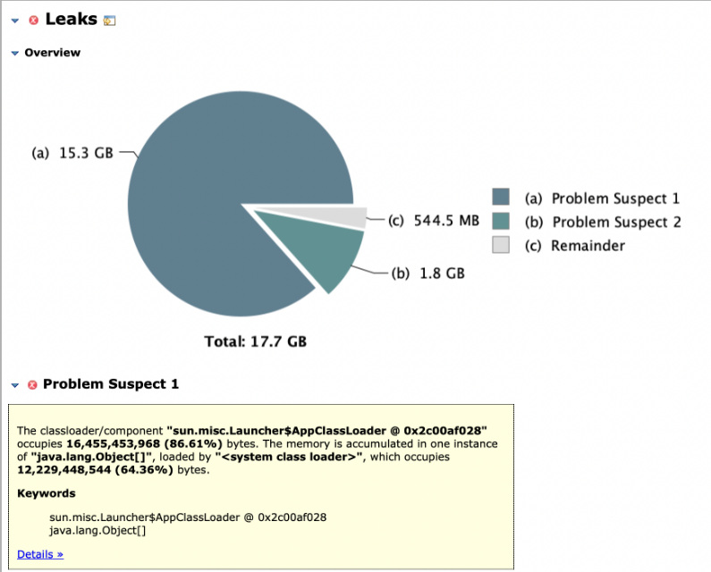
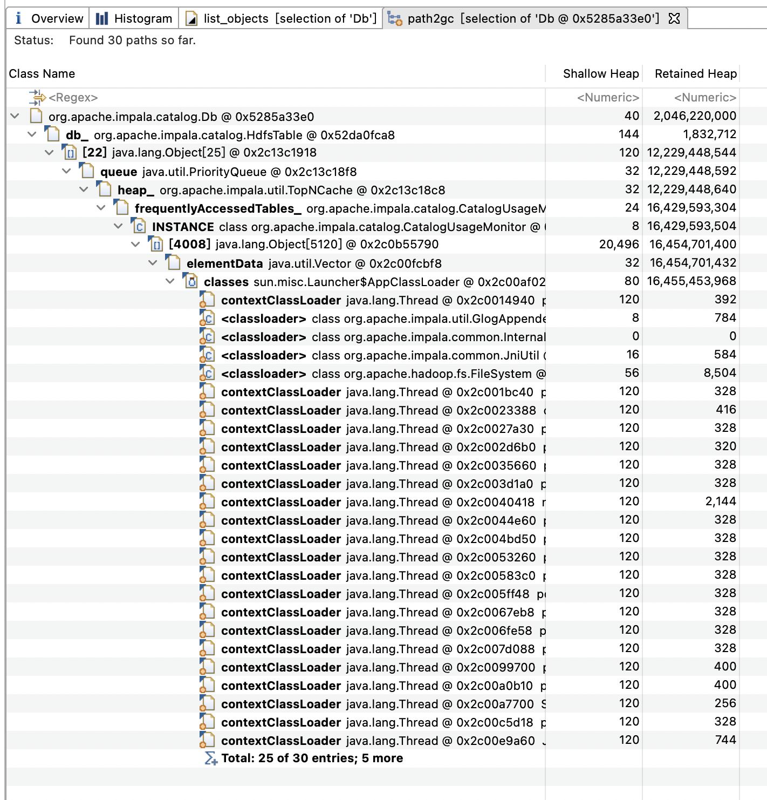
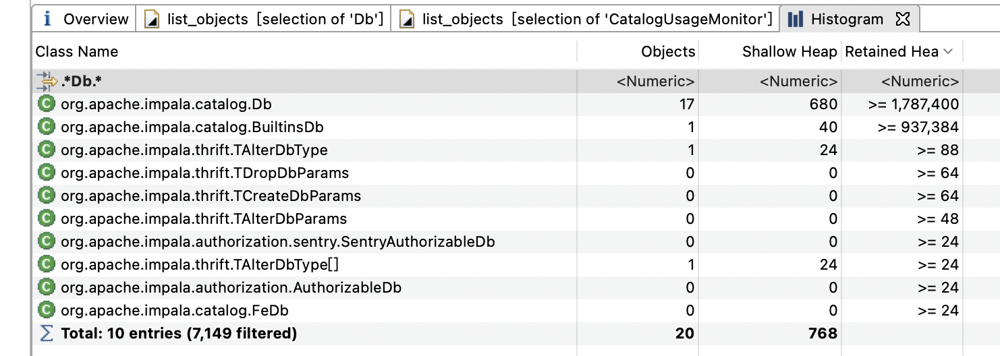

# Impala问题记录

## python2证书问题

运行Impala的脚本`infra/python/deps/pip_download.py`下载pip包的时候，本来想配置一个镜像来加速下载，但是配置完`export PYPI_MIRROR=https://pypi.tuna.tsinghua.edu.cn`之后发现python2访问镜像地址会报错：

```
python2 -c 'from urllib2 import urlopen; urlopen("https://mirrors.tuna.tsinghua.edu.cn/help/pypi/")'
Traceback (most recent call last):
  File "<string>", line 1, in <module>
  File "/usr/lib64/python2.7/urllib2.py", line 154, in urlopen
    return opener.open(url, data, timeout)
  File "/usr/lib64/python2.7/urllib2.py", line 431, in open
    response = self._open(req, data)
  File "/usr/lib64/python2.7/urllib2.py", line 449, in _open
    '_open', req)
  File "/usr/lib64/python2.7/urllib2.py", line 409, in _call_chain
    result = func(*args)
  File "/usr/lib64/python2.7/urllib2.py", line 1258, in https_open
    context=self._context, check_hostname=self._check_hostname)
  File "/usr/lib64/python2.7/urllib2.py", line 1214, in do_open
    raise URLError(err)
urllib2.URLError: <urlopen error [SSL: CERTIFICATE_VERIFY_FAILED] certificate verify failed (_ssl.c:618)>
```

浏览器访问该地址是没有证书相关问题的，换成http协议会自动跳转到https协议的地址。一开始我以为服务器证书有问题，改代码肯定可以，但是有没有不改代码能生效的方法？于是请教了新来的大牛，大牛一顿操作最终帮我解决了问题。

大佬先查看了下环境：

```
$ cat /etc/redhat-release
CentOS Linux release 7.9.2009 (Core)
```

然后用镜像源安装了下requests：

```shell
PYPI_MIRROR=https://pypi.python.org pip2 install --user requests
```

又升级了下：

```shell
PYPI_MIRROR=https://pypi.python.org pip2 install --user --upgrade requests
```

发现没有问题之后又尝试运行了下脚本：

```shell
python2 pip_download.py
```

然后进python交互终端执行：

```
from urllib2 import urlopen; urlopen("https://mirrors.tuna.tsinghua.edu.cn/help/pypi/")
```

发现还是报错。

然后试探性请求了下镜像源：

```
$ curl -v > /dev/null  https://pypi.tuna.tsinghua.edu.cn/
  % Total    % Received % Xferd  Average Speed   Time    Time     Time  Current
                                 Dload  Upload   Total   Spent    Left  Speed
  0     0    0     0    0     0      0      0 --:--:-- --:--:-- --:--:--     0* About to connect() to pypi.tuna.tsinghua.edu.cn port 443 (#0)
*   Trying 101.6.15.130...
* Connected to pypi.tuna.tsinghua.edu.cn (101.6.15.130) port 443 (#0)
* Initializing NSS with certpath: sql:/etc/pki/nssdb
*   CAfile: /etc/pki/tls/certs/ca-bundle.crt
  CApath: none
  0     0    0     0    0     0      0      0 --:--:-- --:--:-- --:--:--     0* SSL connection using TLS_ECDHE_RSA_WITH_AES_256_GCM_SHA384
* Server certificate:
* 	subject: CN=tuna.tsinghua.edu.cn
* 	start date: 9月 26 09:10:36 2021 GMT
* 	expire date: 12月 25 09:10:35 2021 GMT
* 	common name: tuna.tsinghua.edu.cn
* 	issuer: CN=R3,O=Let's Encrypt,C=US
> GET / HTTP/1.1
> User-Agent: curl/7.29.0
> Host: pypi.tuna.tsinghua.edu.cn
> Accept: */*
> 
< HTTP/1.1 302 Moved Temporarily
< Server: nginx/1.18.0
< Date: Thu, 28 Oct 2021 11:17:48 GMT
< Content-Type: text/html
< Content-Length: 145
< Connection: keep-alive
< Location: https://mirrors.tuna.tsinghua.edu.cn/help/pypi
< 
{ [data not shown]
100   145  100   145    0     0    730      0 --:--:-- --:--:-- --:--:--   728
* Connection #0 to host pypi.tuna.tsinghua.edu.cn left intact
```

然后继续请求跳转之后的地址：

```
curl -v > /dev/null https://mirrors.tuna.tsinghua.edu.cn/help/pypi
...
curl -v > /dev/null https://mirrors.tuna.tsinghua.edu.cn/help/pypi/
...
```

查看证书的rpm包：

```
$ rpm -qa | fgrep cert
ca-certificates-2020.2.41-70.0.el7_8.noarch
```

列出安装包的文件：

```
# rpm -ql ca-certificates
/etc/pki/ca-trust
...
/etc/pki/tls
/etc/pki/tls/cert.pem
/etc/pki/tls/certs
/etc/pki/tls/certs/ca-bundle.crt
/etc/pki/tls/certs/ca-bundle.trust.crt
/etc/ssl
/etc/ssl/certs
...
```

使用python3请求相应地址：

```
// TODO
```

查看证书版本信息：

```
$ rpm -ql ca-certificates -i
Name        : ca-certificates
Version     : 2020.2.41
Release     : 70.0.el7_8
Architecture: noarch
Install Date: 2020年11月13日 星期五 09时54分08秒
Group       : System Environment/Base
Size        : 946094
License     : Public Domain
Signature   : RSA/SHA256, 2020年06月24日 星期三 01时38分15秒, Key ID 24c6a8a7f4a80eb5
Source RPM  : ca-certificates-2020.2.41-70.0.el7_8.src.rpm
Build Date  : 2020年06月23日 星期二 23时39分22秒
Build Host  : x86-02.bsys.centos.org
Relocations : (not relocatable)
Packager    : CentOS BuildSystem <http://bugs.centos.org>
Vendor      : CentOS
URL         : http://www.mozilla.org/
Summary     : The Mozilla CA root certificate bundle
Description :
This package contains the set of CA certificates chosen by the
Mozilla Foundation for use with the Internet PKI.
...
```

查看证书目录：

```
cd /etc/pki/ca-trust
ll
cat README
```

尝试更新证书：

```
update-ca-trust
```

使用strace查看python2使用的证书：

```
$ PYPI_MIRROR=https://pypi.tuna.tsinghua.edu.cn strace -f -etrace=open python2 ./pip_download.py

...
[pid  2846] open("/dev/urandom", O_RDONLY|O_NOCTTY|O_NONBLOCK) = 4
[pid  2846] open("/etc/pki/tls/cert.pem", O_RDONLY) = 4
[pid  2849] open("/etc/pki/tls/cert.pem", O_RDONLY) = 4
[pid  2847] open("/etc/pki/tls/cert.pem", O_RDONLY) = 6
[pid  2849] open("/etc/nsswitch.conf", O_RDONLY|O_CLOEXEC) = 4
[pid  2849] open("/etc/host.conf", O_RDONLY|O_CLOEXEC) = 4
[pid  2849] open("/etc/resolv.conf", O_RDONLY|O_CLOEXEC) = 4
[pid  2849] open("tls/x86_64/libnss_files.so.2", O_RDONLY|O_CLOEXEC) = -1 ENOENT (No such file or directory)
[pid  2849] open("tls/libnss_files.so.2", O_RDONLY|O_CLOEXEC) = -1 ENOENT (No such file or directory)
[pid  2849] open("x86_64/libnss_files.so.2", O_RDONLY|O_CLOEXEC) = -1 ENOENT (No such file or directory)
[pid  2849] open("libnss_files.so.2", O_RDONLY|O_CLOEXEC) = -1 ENOENT (No such file or directory)
[pid  2849] open("/opt/jdk/java/jre/lib/amd64/libnss_files.so.2", O_RDONLY|O_CLOEXEC) = -1 ENOENT (No such file or directory)
[pid  2849] open("/opt/jdk/java/jre/lib/amd64/server/libnss_files.so.2", O_RDONLY|O_CLOEXEC) = -1 ENOENT (No such file or directory)
[pid  2849] open("/etc/ld.so.cache", O_RDONLY|O_CLOEXEC) = 4
[pid  2849] open("/lib64/libnss_files.so.2", O_RDONLY|O_CLOEXEC) = 4
[pid  2849] open("/etc/hosts", O_RDONLY|O_CLOEXEC) = 4
[pid  2849] open("tls/x86_64/libnss_dns.so.2", O_RDONLY|O_CLOEXEC) = -1 ENOENT (No such file or directory)
[pid  2849] open("tls/libnss_dns.so.2", O_RDONLY|O_CLOEXEC) = -1 ENOENT (No such file or directory)
[pid  2849] open("x86_64/libnss_dns.so.2", O_RDONLY|O_CLOEXEC) = -1 ENOENT (No such file or directory)
[pid  2849] open("libnss_dns.so.2", O_RDONLY|O_CLOEXEC) = -1 ENOENT (No such file or directory)
[pid  2849] open("/opt/jdk/java/jre/lib/amd64/libnss_dns.so.2", O_RDONLY|O_CLOEXEC) = -1 ENOENT (No such file or directory)
[pid  2849] open("/opt/jdk/java/jre/lib/amd64/server/libnss_dns.so.2", O_RDONLY|O_CLOEXEC) = -1 ENOENT (No such file or directory)
[pid  2849] open("/etc/ld.so.cache", O_RDONLY|O_CLOEXEC) = 4
[pid  2849] open("/lib64/libnss_dns.so.2", O_RDONLY|O_CLOEXEC) = 4
[pid  2846] open("/etc/hosts", O_RDONLY|O_CLOEXEC) = 7
[pid  2848] open("/etc/pki/tls/cert.pem", O_RDONLY) = 6
[pid  2847] open("/etc/hosts", O_RDONLY|O_CLOEXEC) = 6
[pid  2848] open("/etc/hosts", O_RDONLY|O_CLOEXEC) = 3
[pid  2847] open("/etc/gai.conf", O_RDONLY|O_CLOEXEC) = -1 ENOENT (No such file or directory)
[Errno socket error] [SSL: CERTIFICATE_VERIFY_FAILED] certificate verify failed (_ssl.c:618)
Sleeping for 18 seconds before retrying
[Errno socket error] [SSL: CERTIFICATE_VERIFY_FAILED] certificate verify failed (_ssl.c:618)
Sleeping for 19 seconds before retrying
[Errno socket error] [SSL: CERTIFICATE_VERIFY_FAILED] certificate verify failed (_ssl.c:618)
Sleeping for 17 seconds before retrying
[Errno socket error] [SSL: CERTIFICATE_VERIFY_FAILED] certificate verify failed (_ssl.c:618)
Sleeping for 13 seconds before retrying
Getting package info from /simple/boto3/
[Errno 2] No such file or directory: '/simple/boto3/'
Sleeping for 155 seconds before retrying
Getting package info from https://pypi.tuna.tsinghua.edu.cn/simple/boto3/
[pid  2847] open("/etc/pki/tls/cert.pem", O_RDONLY) = 8
[pid  2847] open("/etc/hosts", O_RDONLY|O_CLOEXEC) = 8
[Errno socket error] [SSL: CERTIFICATE_VERIFY_FAILED] certificate verify failed (_ssl.c:618)
Sleeping for 18 seconds before retrying
Getting package info from /simple/botocore/
[Errno 2] No such file or directory: '/simple/botocore/'
Sleeping for 108 seconds before retrying
Getting package info from https://pypi.tuna.tsinghua.edu.cn/simple/botocore/
[pid  2849] open("/etc/pki/tls/cert.pem", O_RDONLY) = 6
[pid  2849] open("/etc/hosts", O_RDONLY|O_CLOEXEC) = 6
Getting package info from https://pypi.tuna.tsinghua.edu.cn/simple/simplejson/
[pid  2846] open("/etc/pki/tls/cert.pem", O_RDONLY) = 9
[pid  2846] open("/etc/hosts", O_RDONLY|O_CLOEXEC) = 9
ccd cGetting package info from https://pypi.tuna.tsinghua.edu.cn/simple/allpairs/
[pid  2848] open("/etc/pki/tls/cert.pem", O_RDONLY) = 10
[pid  2848] open("/etc/hosts", O_RDONLY|O_CLOEXEC) = 10
c[Errno socket error] [SSL: CERTIFICATE_VERIFY_FAILED] certificate verify failed (_ssl.c:618)
Sleeping for 35 seconds before retrying
[Errno socket error] [SSL: CERTIFICATE_VERIFY_FAILED] certificate verify failed (_ssl.c:618)
Sleeping for 36 seconds before retrying
f[Errno socket error] [SSL: CERTIFICATE_VERIFY_FAILED] certificate verify failed (_ssl.c:618)
Sleeping for 5 seconds before retrying
```

进入目录：

```
cd /etc/pki/tls
cat cert.pem
```

在基本确定是证书的问题之后，大佬在自己的电脑上继续查找资料和试验，过了以后告诉我，这是python2的bug，系统的证书库里有一个旧的证书 DST Root CA X3，过期时间  Sep 30 14:01:15 2021 GMT，当这个证书存在的时候，python2就会失败。解决办法就是将此证书加入黑名单：

```
$ cat /etc/pki/ca-trust/source/blacklist/Old-DST-Root-CA-X3.pem
-----BEGIN CERTIFICATE-----
MIIDSjCCAjKgAwIBAgIQRK+wgNajJ7qJMDmGLvhAazANBgkqhkiG9w0BAQUFADA/
MSQwIgYDVQQKExtEaWdpdGFsIFNpZ25hdHVyZSBUcnVzdCBDby4xFzAVBgNVBAMT
DkRTVCBSb290IENBIFgzMB4XDTAwMDkzMDIxMTIxOVoXDTIxMDkzMDE0MDExNVow
PzEkMCIGA1UEChMbRGlnaXRhbCBTaWduYXR1cmUgVHJ1c3QgQ28uMRcwFQYDVQQD
Ew5EU1QgUm9vdCBDQSBYMzCCASIwDQYJKoZIhvcNAQEBBQADggEPADCCAQoCggEB
AN+v6ZdQCINXtMxiZfaQguzH0yxrMMpb7NnDfcdAwRgUi+DoM3ZJKuM/IUmTrE4O
rz5Iy2Xu/NMhD2XSKtkyj4zl93ewEnu1lcCJo6m67XMuegwGMoOifooUMM0RoOEq
OLl5CjH9UL2AZd+3UWODyOKIYepLYYHsUmu5ouJLGiifSKOeDNoJjj4XLh7dIN9b
xiqKqy69cK3FCxolkHRyxXtqqzTWMIn/5WgTe1QLyNau7Fqckh49ZLOMxt+/yUFw
7BZy1SbsOFU5Q9D8/RhcQPGX69Wam40dutolucbY38EVAjqr2m7xPi71XAicPNaD
aeQQmxkqtilX4+U9m5/wAl0CAwEAAaNCMEAwDwYDVR0TAQH/BAUwAwEB/zAOBgNV
HQ8BAf8EBAMCAQYwHQYDVR0OBBYEFMSnsaR7LHH62+FLkHX/xBVghYkQMA0GCSqG
SIb3DQEBBQUAA4IBAQCjGiybFwBcqR7uKGY3Or+Dxz9LwwmglSBd49lZRNI+DT69
ikugdB/OEIKcdBodfpga3csTS7MgROSR6cz8faXbauX+5v3gTt23ADq1cEmv8uXr
AvHRAosZy5Q6XkjEGB5YGV8eAlrwDPGxrancWYaLbumR9YbK+rlmM6pZW87ipxZz
R8srzJmwN0jP41ZL9c8PDHIyh8bwRLtTcm1D9SZImlJnt1ir/md2cXjbDaJWFBM5
JDGFoqgCWjBH4d1QB7wCCZAA62RjYJsWvIjJEubSfZGL+T0yjWW06XyxV3bqxbYo
Ob8VZRzI9neWagqNdwvYkQsEjgfbKbYK7p2CNTUQ
-----END CERTIFICATE-----
```

然后更新证书：

```
update-ca-trust
```

验证没有问题：

```
python2 -c 'from urllib2 import urlopen; urlopen("https://mirrors.tuna.tsinghua.edu.cn/help/pypi/")'
```

参考：

[Old Let’s Encrypt Root Certificate Expiration and OpenSSL 1.0.2](https://www.openssl.org/blog/blog/2021/09/13/LetsEncryptRootCertExpire/)

## 一个JDBC的loginTimeout超时问题

线上的Impala遇到一个Socket超时问题，报错堆栈如下：

```
org.apache.hive.jdbc.HiveConnection []: Error opening session
org.apache.thrift.transport.TTransportException: java.net.SocketTimeoutException: Read timed out
        at org.apache.thrift.transport.TIOStreamTransport.read(TIOStreamTransport.java:129)
        at org.apache.thrift.transport.TTransport.readAll(TTransport.java:86)
        at org.apache.thrift.protocol.TBinaryProtocol.readAll(TBinaryProtocol.java:429)
        at org.apache.thrift.protocol.TBinaryProtocol.readI32(TBinaryProtocol.java:318)
        at org.apache.thrift.protocol.TBinaryProtocol.readMessageBegin(TBinaryProtocol.java:219)
        at org.apache.thrift.TServiceClient.receiveBase(TServiceClient.java:77)
        at org.apache.hive.service.cli.thrift.TCLIService$Client.recv_OpenSession(TCLIService.java:156)
        at org.apache.hive.service.cli.thrift.TCLIService$Client.OpenSession(TCLIService.java:143)
        at org.apache.hive.jdbc.HiveConnection.openSession(HiveConnection.java:464)
        at org.apache.hive.jdbc.HiveConnection.<init>(HiveConnection.java:181)
        at org.apache.hive.jdbc.HiveDriver.connect(HiveDriver.java:105)
        at java.sql.DriverManager.getConnection(DriverManager.java:664)
        at java.sql.DriverManager.getConnection(DriverManager.java:270)
Caused by: java.net.SocketTimeoutException: Read timed out
        at java.net.SocketInputStream.socketRead0(Native Method)
        at java.net.SocketInputStream.socketRead(SocketInputStream.java:116)
```

看了下日志，大约30s就超时了，通常来说Impala的查询的执行时间有可能是分钟级别的，这么短的超时时间明显不对劲，咨询了下大佬Java的Socket超时有可能提前结束吗，大佬的答案是否定的。因为我们用的是Hive JDBC Driver，看了一下Socket超时时间是在thrift的TSocket构造函数里设置的：

https://github.com/apache/hive/blob/rel/release-3.1.3/common/src/java/org/apache/hadoop/hive/common/auth/HiveAuthUtils.java#L45

而 loginTimeout 的取值就有点二了，是从DriverManager的静态方法获取的：

https://github.com/apache/hive/blob/rel/release-3.1.3/jdbc/src/java/org/apache/hive/jdbc/HiveConnection.java#L806

这也就意味着 loginTimeout 的设置没法做到很好的隔离性。用 arthas 看了一下DriverManager.logintimeout的值，还真的是 30s：

```
[arthas@21070]$ getstatic java.sql.DriverManager loginTimeout
field: loginTimeout
@Integer[30]
Affect(row-cnt:1) cost in 19ms
```

而这30s的始作俑者猜一下也大概是跟JDBC有关的其他Driver或者连接池，最终发现是连接MySQL用的HikariCP连接池里做的手脚：

https://github.com/brettwooldridge/HikariCP/blob/HikariCP-4.0.3/src/main/java/com/zaxxer/hikari/pool/PoolBase.java#L114

 https://github.com/brettwooldridge/HikariCP/blob/HikariCP-4.0.3/src/main/java/com/zaxxer/hikari/pool/PoolBase.java#L343

  https://github.com/brettwooldridge/HikariCP/blob/HikariCP-4.0.3/src/main/java/com/zaxxer/hikari/pool/PoolBase.java#L624

   https://github.com/brettwooldridge/HikariCP/blob/HikariCP-4.0.3/src/main/java/com/zaxxer/hikari/util/DriverDataSource.java#L154

这可能算是 JDBC 设计上的一个缺陷吧，全局的静态变量就没法做到线程隔离了，至于 HikariCP 也遵循这个规则的原因就不得而知了。

Hive 的 master 分支其实已经修复了这个问题，修复的方式是由一个新增的 sessionVar 变量来控制，但是Hive JDBC迟迟没有发布正式的版本，最后的修复方法只能是backports了[HIVE-12371](https://github.com/apache/hive/pull/1611)的 patch了。

### 参考

[HIVE-12371 Adding a timeout connection parameter for JDBC](https://issues.apache.org/jira/browse/HIVE-12371)

## IMPALA-6876：一个Catalog内存泄露问题

一个线上环境的catalogd JVM的最大堆内存已经配置了20G，还是会发生OOM，虽然表很多但是不至于占这么大内存，怀疑是不是哪里有内存泄露。这个环境的Impala版本是3.2，由于JVM参数配置了`X:+HeapDumpOnOutOfMemoryError`，于是便把dump文件拿下来分析了一下。


按Retained Heap看Histogram，占比大的主要还是HdfsTable和HdfsPartition这两个类：


Leak报告如下：




可以看出CatalogUsageMonitor引用的内存占用很大，直观地怀疑内存泄露发生在CatalogUsageMonitor里面的PriorityQueue里，但是CatalogUsageMonitor里面的PriorityQueue长度最大只有 25，感觉无从下手。

后来看Histogram发现一个可疑的地方是，org.apache.impala.catalog.Db的实例一共有 25 个，其中有 9 个org.apache.impala.catalog.Db对象都是同一个库的不同版本的实例：


同一个 Db 的旧版本的 org.apache.impala.catalog.Db 实例没有被 gc 掉，这可能就是问题的原因。每个引用的内存约在 2G，也解释了JVM 内存的主要来源。

查看旧版本org.apache.impala.catalog.Db到 GCRoot 的引用终于找到了gc不掉的原因：



从上图可以看出，虽然其他地方已经没有引用了，但是旧版本org.apache.impala.catalog.Db还通过 Table 被CatalogUsageMonitor里的 TopNCache 引用了。

临时解决方式：将下面的参数添加到 catalogd 的 JVM 参数里：

```
-Dorg.apache.impala.catalog.CatalogUsageMonitor.NUM_TABLES_TRACKED=1
```

再次手动执行dump命令(jmap -dump:live,format=b)，分析下dump文件，可以看到总堆内存降到 1G 以下：


org.apache.impala.catalog.Db实例总数下降，没有多余版本的 org.apache.impala.catalog.Db：



搜了一下，其实社区里早就有人提出了这个问题：https://issues.apache.org/jira/browse/IMPALA-6876，只是一直没人解决。

## Join优化

| Issues      | 描述       |
| ----------- | ---------- |
| IMPALA-5022 | 外连接化简 |
|             |            |
|             |            |
|             |            |
|             |            |

## IMPALA-12362：服务管理脚本改进

由于社区版Apache Impala并没有提供现成的二进制包构建方式，我相信大部分公司使用Impala是依赖于Cloudera公司的CDH发行版的。“社区苦Impala无包久矣”。

好在这件事情将成为历史，在千呼万唤之中，社区在Impala 4.3版本中补足了构建二进制包的能力（IMPALA-10262），这样社区用户就可以不依赖于CDH进行Impala的部署和升级。在4.4版本中对服务管理脚本又有了进一步的改进（IMPALA-12362）。今天就对打包和服务管理脚本的使用进行一个介绍。

### 二进制包的构建

二进制包的构建依赖于cmake的install命令和CPack命令，但是都被封装到buildall.sh脚本中了，只需要执行如下命令即可：

```
./buildall.sh -noclean -skiptests -release -package
```

脚本执行完成之后就会在`package/build`构建出来一个名字类似`apache-impala-4.4.0_hive-3.1.3-369-x86_64.deb`的DEB包或者RPM包，可以用于部署。

### 二进制包的部署

二进制包的目录结构如下：

```
.
|-- LICENSE
|-- NOTICE
|-- bin
|   `-- impala.sh                                   # 服务管理脚本
|-- conf
|   |-- core-site.xml.template                      # core-site.xml配置文件的模板，需要根据集群环境进行修改
|   |-- hdfs-site.xml.template                      # hdfs-site.xml配置文件的模板，需要根据集群环境进行修改
|   |-- hive-site.xml.template                      # hive-site.xml配置文件的模板，需要根据集群环境进行修改
|   |-- llama-site.xml.template                     # llama-site.xml配置文件的模板
|   |-- fair-scheduler.xml.template                 # fair-scheduler.xml配置文件的模板
|   |-- impala-env.sh                               # impala.sh依赖的环境变量配置
|   |-- impalad_flags                               # impalad的flag文件
|   |-- catalogd_flags                              # catalogd的flag文件
|   |-- admissiond_flags                            # admissiond的flag文件
|   `-- statestored_flags                           # statestored的flag文件
|-- lib
|   |-- jars                                        # fe的jar包及其依赖
|   `-- native                                      # be依赖的native库
|-- sbin
|   |-- admissiond -> impalad
|   |-- catalogd -> impalad
|   |-- impalad                                     # be的二进制文件
|   `-- statestored -> impalad
|-- shell                                           # impala-shell及其依赖
|-- util
|   `-- impala-profile-tool                         # 用于反解析profile的工具
`-- www                                             # WebUI依赖的静态js,css文件
```

Impala相关配置文件都在`conf`目录下，在OS上安装完二进制包之后，需要根据Hive和Hadoop集群的环境修改下对应配置文件，包括添加`conf/core-site.xml`，`conf/hdfs-site.xml`和`conf/hive-site.xml`这三个文件，如果需要对`admission control`进行配置，还需要添加`conf/fair-scheduler.xml`和`conf/llama-site.xml`这两个文件。

Impala服务的flag配置文件也都在conf目录下，文件名为`$service_flags`。默认配置可以启动，但是建议根据需要进行修改，比如日志目录的配置项：`-log_dir`，minidump文件目录：`-minidump_path`。

最后一个比较重要的配置文件是`conf/impala-env.sh`，用于指定impala.sh脚本用到的环境变量。其中最重要的环境变量是`JAVA_HOME`。建议对其中配置pid文件，标准输出文件，标准错误文件位置的环境变量进行修改。

为了实现可以通过命令行进行覆盖，impala-env.sh中的环境变量都通过下面的格式配置：

```
: ${FOO:="bar"}
```

或者：

```
# 将环境变量导出
export FOO=${FOO:-"bar"}
```

### 服务管理

服务管理主要依赖于`bin/impala.sh`脚本，通过执行`bin/impala.sh --help`可以看到使用帮助，主要分为如下几个子命令：

| 子命令    | 说明             | 完整格式                                  |
| --------- | ---------------- | ----------------------------------------- |
| --help    | 显示使用帮助     | `--help`                                  |
| --version | 显示版本号       | `--version`                               |
| status    | 查询进程状态     | `status <service> `                       |
| health    | 查询服务是否可用 | `health [<options>] <service>`            |
| stop      | 停止服务         | `stop [<options>] <service>`              |
| start     | 启动服务         | `start [<options>] <service> [<flags>]`   |
| restart   | 重启服务         | `restart [<options>] <service> [<flags>]` |

如果命令正常执行，退出码为0，否则为非0。

#### help子命令

help子命令用来显示使用帮助。

#### version子命令

version子命令用来显示版本号。

#### status子命令

status子命令用来查询服务的进程（进程号记录在pid文件中）是否存活，如果进程存活则退出码为0，否则为非0。

#### health子命令

health子命令用来查询服务是否可用，服务可用的判断依据是Web接口`/healthz`返回`OK`。默认情况下health命令会轮询直到服务可用，或者等待超时。轮询的时间间隔（秒）可以通过`-p`选项指定，轮询的最大次数可以通过`-c`选项指定。如果服务可用则立即返回，退出码为0；如果服务的进程退出，或者等待超时则退出码为非0。

#### start子命令

start子命令用于启动服务，完整格式为：

```
start <options> <service> [<flags>]

options:
  -c: maximum count of checks, defaults to 20.
  -p: seconds of period between checks, defaults to 2.

service: {impalad|catalogd|admissiond|statestored}
```

start子命令会调用`status`子命令和`health`子命令轮询启动后的进程状态和服务可用状态，直到进程退出，服务可用或者等待超时。轮询的时间间隔（秒）可以通过`-p`选项指定，轮询的最大次数可以通过`-c`选项指定。可以通过指定`-c 0`选项实现不检查服务可用状态。

服务启动的时候会写三个文件，包括：pid文件，标准输出文件，标准错误文件，这三个文件的位置通过环境变量控制，比如Impalad的三个环境变量名分别是：`IMPALAD_PIDFILE`，`IMPALAD_STDOUTFILE`和`IMPALAD_STDERRFILE`。默认配置在`conf/impala-env.sh`中。

服务启动的时候会读取`conf/$service_flags`文件中的配置项，可以通过在service名的后面追加配置项进行覆盖。这在某些情况下比较有用，比如想要在同一台机器上的同一个目录中启动多个`Impalad`实例，默认情况下启动第二个服务实例的时候会因为端口已经被占用而报错，这个时候可以通过在service名后面指定端口解决，比如：

```shell
IMPALAD_PIDFILE=/var/run/impalad2.pid \
IMPALAD_STDOUTFILE=/var/log/impalad2.out \
IMPALAD_STDERRFILE=/var/log/impalad2.err \
/opt/impala/bin/impala.sh \
restart impalad \
-log_filename=impalad2 \
--beeswax_port=21002 \
--hs2_port=21052 \
--state_store_subscriber_port=23002 \
--webserver_port=25002 \
--krpc_port=27002 \
--hs2_http_port=28002
```

#### stop子命令

start子命令用于停止服务，完整格式为：

```
stop [<options>] <service>

options:
  -c: maximum count of checks, defaults to 20.
  -f: force kill a daemon service.
  -g: graceful shutdown the impalad service.
  -p: seconds of period between checks, defaults to 2.

service: {impalad|catalogd|admissiond|statestored}
```

stop子命令同样会调用`status`子命令轮询进程状态直到进程退出或者等待超时。轮询的时间间隔（秒）可以通过`-p`选项指定，轮询的最大次数可以通过`-c`选项指定。

默认stop命令会给进程发送SIGTERM信号，如果指定了`-f`选项则会发送SIGKILL信号以强制终止进程（[IMPALA-13001](http://issues.apache.org/jira/browse/IMPALA-13001)）。

通过指定`-g`选项可以实现优雅停机（[IMPALA-13001](http://issues.apache.org/jira/browse/IMPALA-13001)）。需要注意的是`-f`选项和`-g`选项不能同时使用。

#### restart子命令

restart子命令用于重启服务，内部实现是依次调用stop子命令和start子命令。完整格式与start子命令相同。
