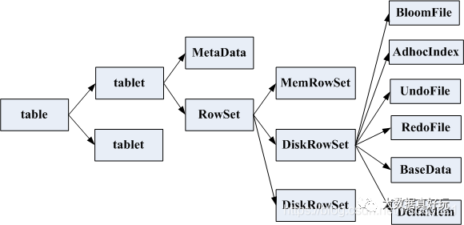

# Kudu笔记

## 设计目标

Kudu 设计最初的目标是:

- 在 HDFS 和 HBase 之间取得一个比较好的折衷
- 尽可能快的列式扫描
- 尽可能快的随机读写，ms 级响应
- 高可用、容错、持久性、响应时长稳定
- 可以充分利用现代化的硬件设施，如 SSD NVMe

## 架构

## 表和模式

1. 必须定义主键，不支持二级索引

2. 根据主键的插入、更新和删除
3. 仅提供 Scan 操作来从表中读取数据
4. 在一次scan中可以添加任意数量的谓词（列和常量值之间的比较，以及复合主键范围）
5. 支持 `projection`
6. Kudu 不提供任何多行事务 API
7.  Kudu 不支持 MVCC 数据模型

Kudu 提供两种一致性模型：

1. 快照一致性：保证了来自单个客户端的读写一致性
2. 外部一致性

## 分区

分区模式由零个或多个哈希分区规则和可选的范围分区规则组成：

- 散列分区规则由主键列的子集和多个bucket组成。

- 范围分区规则由主键列的有序子集组成。

分区规则：

- hash分区规则：首先连接指定列的值，然后以bucket数为模计算结果字符串的哈希码，从而将元组转换为二进制键。

- 范围分区规则：通过使用保序编码连接指定列的值，将元组映射为二进制字符串。

通过使用这些分区规则，用户可以根据他们的特定工作负载轻松地在查询并行性和查询并发性之间进行权衡。

【误区】hash分区和范围分区在物理存储上哪个先哪个后？

## 副本

写入操作同步过程：

1. 向leader副本发送写入 RPC
2. 加锁
3. 选择一个 MVCC 时间戳
4. 并通过 Raft 向其follower提议操作
5. 如果大多数副本接受写入并将其记录到自己的本地预写日志，则在所有副本上提交

如果leader本身失败，Raft 算法会迅速选出一个新的leader。

Kudu 使用 500 毫秒的心跳间隔和 1500 毫秒的选举超时；

Kudu 对 Raft 算法进行了一些改进：

1. 我们在leader选举失败后采用指数退避算法。
2. 当一个新的leader联系一个日志与自己不同的follower时，Kudu 立即跳回到最后一个已知的 committedIndex

Kudu 不会复制tablet的磁盘存储，而只会复制其操作日志。tablet的每个副本上的物理存储完全解耦。

remote bootstrap添加副本过程：

1. 提交配置更改：新副本添加为PRE VOTER状态
2. Raft leader副本触发 StartRemoteBootstrap RPC
3. 目标服务器从当前leader那里拉取tablet数据和日志的快照
4. 新服务器会按照与服务器重启后相同的过程打开tablet
5. 重放任何必要的预写日志
6. 提交配置更改：将新副本转换为完整 VOTER

删除副本过程：

1. 提交配置更改：剔除要驱逐的节点
2. 其余节点将配置更改报告给 Master
3. Master 向被删除的节点发送 DeleteTablet RPC

## Kudu Master

Kudu Master关键的职责：

1. catalog manager：schema的当前version，复制级别。表的状态（creating, running, deleting等），tablet集合。
2. 集群协调器：服务器状态监控，故障转移
3. tablet目录：哪些tablet server托管每个tablet的副本

备份主节点仅充当 Raft follower，不为客户端请求提供服务。

创建表过程：

1. master将表记录写入catalog表
2. master选择tablet server来托管tablet副本，master创建tablet元数据
3. master向tablet server上发送创建副本请求

schema变更和删除和创建表类似。

tablet状态管理过程：

1. Leader如果很长一段时间内没有与follower成功通信，它会提出 Raft 配置更改，将 follower 从 Raft 配置中删除
2. 配置更改提交后，其余的 tablet servers 将向 Master 发出 tablet 报告
3. Master 会建议对 tablet 的leader副本进行配置更改
4. leader副本提出并提交配置更改操作，
5. 通过tablet报告通知 Master 配置更改成功

## Tablet存储

Kudu 中tablet存储的实现解决了几个目标：

1. 与Parquet类似的scan性能
2. 低延迟随机更新
3. 牺牲峰值性能以实现性能的可预测性

RowSets：

1. 包括一个MemRowSet和多个DiskRowSet
2. 任何给定的活动（未删除）行都存在于一个 RowSet 中
3. 不同RowSets行集不相交
4. 不同RowSets的主键区间可能会相交
5. 任何时候都有一个 MemRowSet 存储所有最近插入的行

MemRowSet 实现：

1. 由内存中带有乐观锁的并发 B 树实现（排序特性允许对主键范围或单个键查找进行有效扫描）
2. B 树的键是对每一行的主键的保序编码（使用 memcmp 操作进行高效树遍历）
3. 使用 MVCC 记录来表示删除，不支持从树中移除元素
4. 不允许修改值大小，变更会附加到每个记录的链表
5. 用next指针将叶节点链接在一起，以提高顺序扫描性能
6. 没有实现完整的”trie树”（不太关心极高的随机访问吞吐量）
7. MemRowSet 是行式存储，即有指针指向单行数据
8. 使用 SSE2 内存预取和JIT 编译进行优化以提高吞吐量

DiskRowSet 实现：

1. DiskRowSet 大小约为32M
2. DiskRowSet由两个主要组件组成：Base数据和Delta存储。
3. Base数据是不可变的
4. Base数据是 DiskRowSet 中行的按列组织的表示。
5. Base数据包括列，主键索引列（保存行的编码主键），分块的布隆过滤器
6. Base数据中列细分为page和每个page在rowset中序数偏移量的B树索引
7. Base数据还包括存储了
8. Delta 存储 = （内存）DeltaMemStores + （磁盘）DeltaFiles
9. DeltaMemStore 是一个并发 B 树
10. DeltaFile 是一个二进制类型的列块
11. Delta 存储都维护从（RowSet行偏移量、MVCC时间戳）元组到 RowChangeList 记录的映射

布隆过滤器结构：

1. 分成 4KB 的page
2. 每个page对应一个小范围的key
3. 用不可变的 B 树结构索引这些page
4. 服务器LRU缓存里缓存了page及其索引

列编码方式：

| Column类型                | 支持的编码方式                | 默认编码方式 |
| :------------------------ | :---------------------------- | :----------- |
| int8, int16, int32, int64 | plain, bitshuffle, run length | bitshuffle   |
| date, unixtime_micros     | plain, bitshuffle, run length | bitshuffle   |
| float, double, decimal    | plain, bitshuffle             | bitshuffle   |
| bool                      | plain, run length             | run length   |
| string, varchar, binary   | plain, prefix, dictionary     | dictionary   |

Bitshuffle编码：重新排列一个值块，以存储每个值的最高有效位，然后第二个最高有效位，依此类推。适合具有许多重复值的列或按主键排序时变化量很小的列。

run length编码：通过存储值和计数将连续重复的值被压缩在一列中。适合按主键排序时具有许多连续重复值的列。

dictionary编码：构建唯一值的字典，并将每个列值编码为字典中对应的索引。适合基数低的列。

前缀编码：公共前缀被压缩在连续的列值中，适合公共前缀相同或主键的第一列相同的值。

数据更新流程：

1. 首先查询DiskRowSet的主键索引列
2. 根据DiskRowSet中列的B 树索引查找包含目标行的page
3. 根据page元数据确定该page内第一个单元格的行偏移量
4. 在page内搜索目标行，从而计算出目标行在整个 DiskRowSet 中的偏移量
5. 将新的增量记录插入行集的 DeltaMemStore

## 插入

Kudu如何确定待插入的主键是否已经存在？

1. 使用DiskRowSets主键 Bloom Filter（LRU缓存）剪枝
2. 使用DiskRowSets主键的最大值/最小值（区间树索引）剪枝
3. 对于不能被剪枝的 DiskRowSet，需要在编码主键列（B 树，page cache）中查找

## 读取

1. 读取是分批运行，每个scanner可以断点续传
2. row batch在内存中是列式的
3. 从 DiskRowSet 读取数据时使用scan的范围谓词来缩小范围：
   1. 如果scan设置了主键下限，在主键列内查找以确定下限row-offset
   2. 如果scan设置了主键上限，在主键列内查找以确定上限row-offset
4. 接下来一次扫描一列：
   1. 定位到目标列起始row-offset
   2. 使用特定page编码的解码器将源列中的单元格复制到内存row batch中
   3. 根据当前scan的 MVCC 快照查询Delta存储，将单元格的更改应用于内存中的row batch
5. 返回batch结果到 RPC 响应中并发送回客户端

## 延迟物化

1. 在读取任何其他列之前读取具有相关range谓词的列
2. 当谓词过滤此batch中所有行的情况下，不读取其他列

## Compaction

|      | Delta Compaction                | RowSet Compaction                                          |
| ---- | ------------------------------- | ---------------------------------------------------------- |
| 功能 | 合并Delta存储和Base存储         | 1. 清理已删除的行 2. 减少主键区间重叠的DiskRowSet的数量 |
| 线程 | 后台maintenance线程             | 后台maintenance线程                                        |
| 时机 | 根据delta和Base数据行数比率确定 | 根据背包问题确定                                           |
| 备注 | 可以按列合并                    | 基于主键的合并                                             |

## 后台线程调度

Kudu多个后台任务包括：

- MemRowSets 刷写磁盘变为 DiskRowSets
- MemDeltaStore 刷写磁盘变为 DeltaFiles
- Delta Compaction: 将 Delta Store 部分数据合并到 Base Data 提升读性能
- RowSet Compaction: 将多个 Disk Rowsets 进行 Compaction, 提升读写效率，物理删除数据行

## 参考

[一文了解Kudu的核心原理](https://cloud.tencent.com/developer/article/1727786)

[Apache Kudu Schema Design](https://kudu.apache.org/docs/schema_design.html)

[Apache Kudu Background Maintenance Tasks](https://kudu.apache.org/docs/background_tasks.html)

[Kudu Tablet 设计文档](https://github.com/apache/kudu/blob/ecbd8700e49bf60f15a9d261f0de425f2ba5413e/docs/design-docs/tablet.md)
