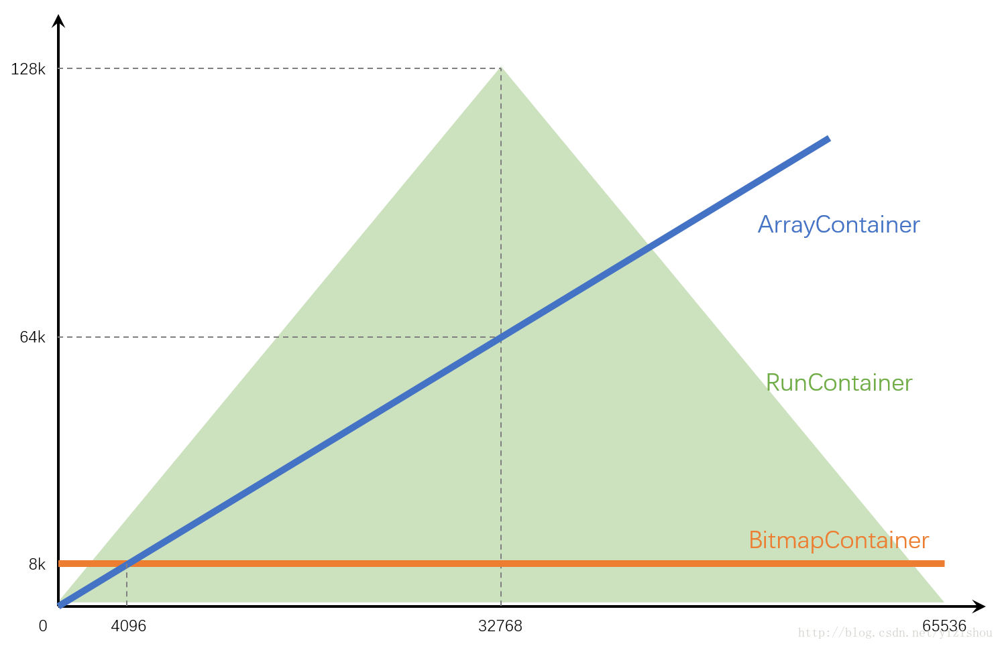

# 数据结构与算法

## 算法

### 排序算法

- 插入排序

  - 直接插入排序
  - 折半插入排序
  - 2-路插入排序
  - 希尔排序

- 交换类

  - 冒泡排序
  - 快速排序

- 选择排序

  - 简单选择排序
  - 锦标赛排序（树形选择排序）
  - 堆排序

- 归并排序
- 基数排序

比较：

| 算法                   | 稳定性 | 时间复杂度（平均/最好/最坏） | 空间复杂度 |
| ---------------------- | ------ | ---------------------------- | ---------- |
| 简单排序（除希尔排序） | T      | O(n^2^)                      | O(1)       |
| 快速排序               | F      | O(nlogn)/O(n^2^)             | O(logn)    |
| 堆排序                 | F      | O(nlogn)                     | O(1)       |
| 归并排序               |        | O(nlogn)                     | O(n)       |
| 基数排序               | T      | O(d(n+rd))                   | O(rd)      |

### 堆排序

堆有以下两个特性：

1. 它是一个完全二叉树
2. 堆中的任意一个父节点的值都大于等于（或小于）它的左右孩子节点。

因此，根据第二个特性，就把二叉堆分为大顶堆（或叫最大堆），和小顶堆（或叫最小堆）。

堆排序的过程：

1. 将一颗完全二叉树构建成堆
2. 循环获取堆顶的最大值放到堆的后面，并重建堆。

## 数据结构

### 二叉树

定义：每个节点最多只有两颗子树，并且二叉树的子树有左右之分。

性质：

1. 第`i`层至多有2^i-1^个结点(`i >= 1`) （归纳法证明）
2. 深度为k的二叉树至多有2^k^ - 1个结点（k >= 1）
3. N~0~(终端结点数) = N~2~ (度为2的结点数) + 1
4. 具有N个结点的完全二叉树的深度为floor(log~2~N) + 1
5. 如果对一颗有n个结点的完全二叉树编号，对任一结点i（1 <= i <= n）有：
   1. parent(i) 是 floor(i / 2) （i < 1）
   2. 如果n < 2i, 则结点无左孩子；否则其左孩子为2i
   3. 如果n < 2i + 1, 则结点无右孩子；否则其左孩子为2i + 1

遍历：分为先序遍历，中序遍历，后序遍历

### BitMap

用于大量数据的快速排序、查找、去重。

RoaringBitmap的主要思路是：将32位无符号整数按照高16位分桶，即最多可能有216=65536个桶，论文内称为container。存储数据时，按照数据的高16位找到container（找不到就会新建一个），再将低16位放入container中。也就是说，一个RoaringBitmap就是很多container的集合。

为了方便理解，照搬论文中的示例图，如下所示。

图中示出了三个container：

- 高16位为0000H的container，存储有前1000个62的倍数。
- 高16位为0001H的container，存储有[216, 216+100)区间内的100个数。
- 高16位为0002H的container，存储有[2×216, 3×216)区间内的所有偶数，共215个。

Container一共有3种：

| 类型            | 数据结构                                                     | 增删改查的时间复杂度 | 空间复杂度            |
| --------------- | ------------------------------------------------------------ | -------------------- | --------------------- |
| ArrayContainer  | unsigned short类型的有序数组                                 | O(logN)              | (2 + 2 * 基数)B       |
| BitmapContainer | 长度固定为1024的unsigned long型数组                          | O(1)                 | 8192B                 |
| RunContainer    | 用可变长度的unsigned short数组存储用行程长度编码（RLE）压缩后的数据 | O(logN)              | (2 + 4 * 连续序列数)B |

创建时：

- 创建包含单个值的Container时，选用ArrayContainer
- 创建包含一串连续值的Container时，比较ArrayContainer和RunContainer，选取空间占用较少的

转换：

针对ArrayContainer：

如果插入值后容量超过4096，则自动转换为BitmapContainer。因此正常使用的情况下不会出现容量超过4096的ArrayContainer。
调用runOptimize()方法时，会比较和RunContainer的空间占用大小，选择是否转换为RunContainer。
针对BitmapContainer：

如果删除某值后容量低至4096，则会自动转换为ArrayContainer。因此正常使用的情况下不会出现容量小于4096的BitmapContainer。
调用runOptimize()方法时，会比较和RunContainer的空间占用大小，选择是否转换为RunContainer。
针对RunContainer：

只有在调用runOptimize()方法才会发生转换，会分别和ArrayContainer、BitmapContainer比较空间占用大小，然后选择是否转换。

#### 参考

[高效压缩位图RoaringBitmap的原理与应用](https://www.jianshu.com/p/818ac4e90daf)

[RoaringBitmap数据结构及原理](https://blog.csdn.net/yizishou/article/details/78342499)

[大数据分析常用去重算法分析『Bitmap 篇』](https://cn.kyligence.io/blog/count-distinct-bitmap/)

### BloomFilter

Bloom filter 是一个数据结构，它可以用来判断某个元素是否在集合内，具有运行快速，内存占用小的特点。

而高效插入和查询的代价就是，Bloom Filter 是一个基于概率的数据结构：它只能告诉我们一个元素绝对不在集合内或可能在集合内。

Bloom filter 的基础数据结构是一个 比特向量（可理解为数组）。

缺点：

- 只能插入元素，不能删除元素；
- 不保证100%准确，总是存在误差。

BloomFilter 流程：

1. 首先需要 k 个 hash 函数，每个函数可以把 key 散列成为 1 个整数；
2. 初始化时，需要一个长度为 n 比特的数组，每个比特位初始化为 0；
3. 某个 key 加入集合时，用 k 个 hash 函数计算出 k 个散列值，并把数组中对应的比特位置为 1；
4. 判断某个 key 是否在集合时，用 k 个 hash 函数计算出 k 个散列值，并查询数组中对应的比特位，如果所有的比特位都是1，认为在集合中。

#### 参考

[4.  Bloom Filters](https://www.cnblogs.com/cjsblog/p/11613708.html)

[高效压缩位图RoaringBitmap的原理与应用](https://www.jianshu.com/p/818ac4e90daf)
