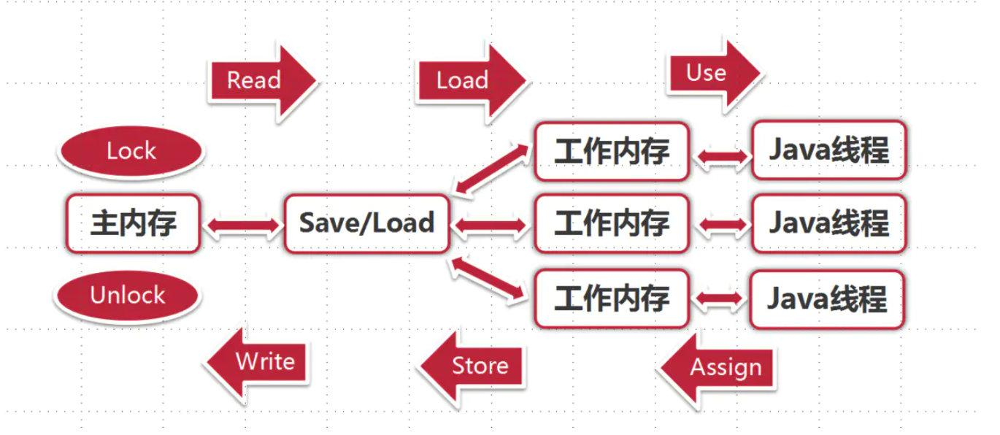

# Java内存模型

## 重要概念

### CPU和缓存一致性问题

随着CPU的技术的发展，CPU的执行速度和内存的读取速度差距越来越大，导致CPU每次操作内存都要耗费很多等待时间。

为了解决这个问题，在CPU和物理内存上新增高速缓存。

随着时代的变迁，CPU开始出现了多核的概念。

最终演变成，多个线程访问进程中的某个共享内存，且这多个线程分别在不同的核心上执行，则每个核心都会在各自的 Cache 中保留一份共享内存的缓冲，我们知道多核是可以并行的，这样就会出现多个线程同时写各自的缓存的情况，导致各自的 Cache 之间的数据可能不同。

总结下来就是：在多核 CPU 中，每个核的自己的缓存，关于同一个数据的缓存内容可能不一致。

### 处理器优化和指令重排

为了使处理器内部的运算单元能够被充分利用，处理器可能会对程序代码进行乱序执行处理，这就是处理器优化。编译器也会有类似的优化

### 并发编程会带来什么问题

并发编程为了保证数据的安全，必须满足以下三个特性：

原子性，指的是在一个操作中CPU 不可以在中途暂停然后再调度，要么不执行，要么就执行完成。
可见性，指的是多个线程访问同一个变量时，一个线程修改了这个变量的值，其他线程能够立即看得到修改后的值。
有序性，指的是程序执行的顺序按照代码的先后顺序执行，而不能瞎几把重排，导致程序出现不一致的结果。

## 什么是内存模型

JVM规范说，Java程序在各个os平台下必须实现一次编译，到处运行的效果！故JVM规范定义了一个模型来屏蔽掉各类硬件和os之间内存访问的差异（比如Java的并发程序必须在不同的os下运行效果是一致的）这个模型就是Java的内存模型。通俗的说：Java内存模型定义了把JVM中的变量存储到内存和从内存中读取出变量的访问规则，这里的变量不算Java栈内的局部变量。

总结来说就是：Java内存模型定义了共享内存系统中多线程程序读写操作行为的规范，通过这些规则来规范对内存的读写操作，从而保证指令执行的正确性，它解决了 CPU 多级缓存、处理器优化、指令重排等导致的内存访问问题，保证了并发场景下的一致性、原子性和有序性。

所有的变量(实例字段、静态字段和构成数组对象的元素，不包括局部变量与方法参数)都存储在主内存中，每条线程还有自己的工作内存（类比处理器高速缓存），保存了被该线程使用到的变量的主内存副本拷贝。线程对变量的所有读取赋值等操作都必须在工作内存中进行，而不能直接读写主内存的变量。

多线程程序主要关注两个问题：

（1）共享变量可见性问题

（2）代码重排序一致性问题

java内存模型定义了8种操作完成如何从工作内存同步到主内存的实现细节：

**锁定（lock）**: 作用于主内存中的变量，将他标记为一个线程独享变量。
**解锁（unlock）**: 作用于主内存中的变量，解除变量的锁定状态，被解除锁定状态的变量才能被其他线程锁定。
**read（读取）**：作用于主内存的变量，它把一个变量的值从主内存传输到线程的工作内存中，以便随后的 load 动作使用。
**load(载入)**：把 read 操作从主内存中得到的变量值放入工作内存的变量的副本中。
**use(使用)**：把工作内存中的一个变量的值传给执行引擎，每当虚拟机遇到一个使用到变量的指令时都会使用该指令。
**assign（赋值）**：作用于工作内存的变量，它把一个从执行引擎接收到的值赋给工作内存的变量，每当虚拟机遇到一个给变量赋值的字节码指令时执行这个操作。
**store（存储）**：作用于工作内存的变量，它把工作内存中一个变量的值传送到主内存中，以便随后的 write 操作使用。
**write（写入）**：作用于主内存的变量，它把 store 操作从工作内存中得到的变量的值放入主内存的变量中。

当数据从JVM的主内存复制一份拷贝到Java线程的工作内存存储时，必须出现两个动作：

- 由JVM主内存执行的读（read）操作
- 由Java线程的工作内存执行相应的load操作

反过来，当数据从线程的工作内存拷贝到JVM的主内存时，也出现两个操作：

- 由Java线程的工作内存执行的存储（store）操作；
- 由JVM主内存执行的相应的写（write）操作

read，load，store，write的操作都是原子的，即执行期间不会被中断，但是各个原子操作之间可能会发生中断。对于普通变量，如果一个线程中那份JVM主内存变量值的拷贝更新了，并不能马上反应在其他变量中，因为Java的每个线程都私有一个工作内存，里面存储了该条线程需要用到的JVM主内存中的变量拷贝！

**对于volatile变量的特殊规则**

1. 保证此变量对所有线程的可见性
2. 禁止指令重排序优化(你看到的代码顺序，不一定是它的执行顺序)

volatile只保证了可见性，不保证原子性

long和double的非原子性协定

**原子性**

1. 基本数据类型的读写是原子性的
2. syncronized修饰的原子性

**可见性**

1. volitile保证了多线程操作时变量的可见性，而普通变量不能保证
2. synchronized和final

**有序性**

1. 如果在本线程内观察所有的操作都是有序的（线程内表现为串行的语义）
2. 如果在一个线程中观察另一个线程，所有的操作都是无序的（指令重排序现象和工作内存与主内存同步延迟）

java提供了volatile和synchronized关键字来保证线程之间的有序性

#### happens-before原则

| 原则             | 说明                                                         |
| ---------------- | ------------------------------------------------------------ |
| 单一线程原则     | 在一个线程内，在程序前面的操作先行发生于后面的操作           |
| 监视器锁规则     | 一个unLock操作先行发生于后面对同一个锁的lock操作             |
| volatile变量规则 | 对一个volatile变量的写操作先行发生于后面对这个变量的读操作   |
| 线程启动规则     | Thread 对象的 start() 方法调用先行发生于此线程的每一个动作   |
| 线程终止规则     | Thread 对象的结束先行发生于 join() 方法返回                  |
| 线程中断规则     | 对线程 interrupt() 方法的调用先行发生于被中断线程的代码检测到中断事件的发生 |
| 对象终结规则     | 一个对象的初始化完成（构造函数执行结束）先行发生于它的 finalize() 方法的开始 |
| 传递性           | 如果操作 A 先行发生于操作 B，操作 B 先行发生于操作 C，那么操作 A 先行发生于操作 C。 |

#### 线程安全的实现方法

1. 互斥同步

   同步指在多个线程并发访问共享数据时保证共享数据在同一个时刻只被一个线程使用。互斥是实现同步的手段，临界区、互斥量、信号量是主要的互斥方式。

2. 非阻塞同步

   如cas

3. 无同步方案

   1. 可重入代码
   2. 线程本地存储

## 参考

[Java面试官告诉你JMM是什么和面什么](https://zhuanlan.zhihu.com/p/345041865)

[Java内存模型 - 同步八种操作](https://segmentfault.com/a/1190000038663581)

[BAT经典面试题，深入理解Java内存模型JMM](https://juejin.cn/post/6844903845152325639)
