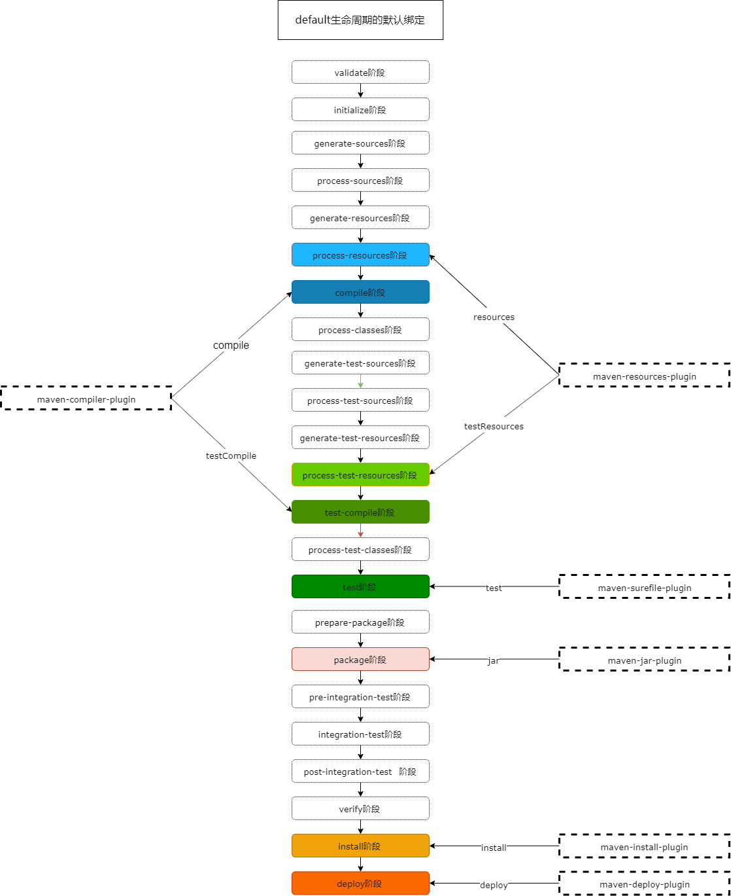
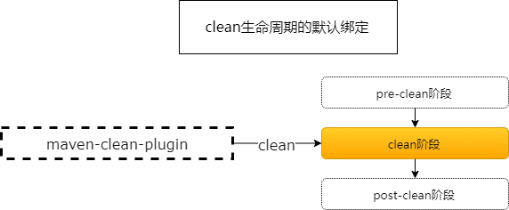

# Maven原理

## 生命周期

### 生命周期阶段

maven中定义了3套相互独立的生命周期：

1. clean生命周期
2. default生命周期
3. site生命周期

每套生命周期中有多个阶段，每套中的多个阶段是有先后顺序的，并且后面的阶段依赖于前面的阶段：


`mvn`命令通过调用这些阶段去完成项目生命周期中具体的操作：

```bash
mvn <phase1> <phase2> <phase3>...
```

执行某个阶段的时候，会按序先执行其前面所有的阶段，例如：

`mvn clean`实际执行的阶段：


`mvn clean install`实际执行的阶段：


`mvn test`实际执行的阶段：


### 插件和生命周期阶段绑定

插件中的每个功能就叫做插件的目标（goal），每个插件中可能包含一个或者多个插件目标。

maven只是定义了生命周期中的阶段，而每个阶段中具体实现是由插件的目标来完成的。所以需要将阶段和插件目标进行绑定，来让插件目标帮助生命周期的阶段做具体的工作，生命周期中的每个阶段支持绑定多个插件的多个目标。

当我们将生命周期中的阶段和插件的目标进行绑定的时候，执行`mvn <phase>`命令就可以执行和这些阶段绑定的插件目标。

maven已经内置了一些插件以及绑定：






## 参考

[Maven系列第6篇：生命周期和插件详解](https://www.cnblogs.com/itsoku123/p/11887484.html)

