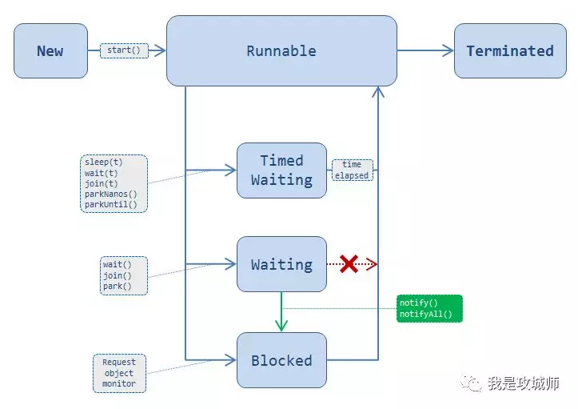

# 多线程

### synchronized关键字

（1）提供了锁操作，可以对于共享资源的访问进行同步从而避免数据竞争

（2）可以避免部分重排序问题，注意是部分不是所有

（3）自动包含加锁和释放锁两个功能。

（4）使用方式有同步块和同步方法两种，注意其不能修饰变量，否则会编译错误。 

（5）进入临界区需要获取锁，退出临界区会释放锁，这里需要注意的是如果在临界区发生未知异常或者错误，或者执行了break，return，Java仍会保证释放锁。

（6）同步块的条件不能是null，否则会抛出空指针异常

（7）synchronized的一个主要缺点是，不允许并发读，这在一些场景下会降低应用的吞吐量，我们可以通过jdk5之后的读写锁来规避这个缺点。

（8）这里的同步仅仅在一个jvm进程中，如果你需要在多个jvm里面实现同步或者互斥操作，需要考虑使用分布式锁如zookeeper，或者redis等

（9）对于同步的静态方法和非静态方法是可以同时访问的，因为他们加锁的一个是类，一个是实例。

（11）synchronized使用不当会导致死锁和活锁，这里需要注意。

（12）synchronized不能用于修饰构造方法。

（13）synchronized不能修饰变量，volatile关键字不能出现在方法内

 （14）java并发包里面提供了更加完善和性能更好的Lock对象。比如被synchronized等待的或者阻塞的线程是没法被打断或者超时的，这个可以在java5之后新的并发包里面使用ReadWriteLock和ReentrantLock来解决，其次在新的并发包里面我们可以对锁的控制粒度更细，比如在一些场景下我可以在一个方法中获取锁，在另外一个方法中释放锁，这是synchronized做不到的。另外，新的并发包我们可以实现非阻塞的操作，通过tryLock方法，如果在synchronized块中，一但有人占用锁，你必须无限的等待，中间什么都不能干，而使用tryLock方法，我们可以知道有人再占用锁，我们先去忙自己的，一会再来看看是否还有人占用，这就是典型的非阻塞。最后新的并发工具底层通过组合使用CAS操作，volatile变量和atomic变量以获得更好的性能。

(15)不推荐使用非final字段作为synchronized block的锁条件，也不推荐使用String类型作为锁条件，因为其引用可变，最佳做法是使用final修饰的Object对象。

### 死锁

死锁指的是两个线程都需要获得锁，但是它们之间又成环引用，从而造成程序无限等待永远不会终止。

#### 如何发现死锁

（1）在win上打开cmd命令，输入jconsole，visualvm，jmc三者任意一个命令，都能打开相关的界面工具，在线程面板中我们可以非常轻而易举的找到死锁，如果找不到可以使用工具提供的死锁检测按钮来分析。

（2）在linux上也有一些方法，不管使用哪种方法，我们需要首先知道程序的进程id，这个可以执行jps -lvm命令来找到：

方法一使用kill -3 java_pid 这个命令并不会杀死Java程序而仅仅在终端到以标准输出流的方式，到处线程的dump信息。

方法二使用jdk自带的jstack命令，执行jstack java_pid 导出线程的dump信息之后，可以找到程序是否有死锁

#### 如何避免死锁

（1）死锁的根源在于有多个同步锁存在，那么最好的解决方法就是没有锁的出现

（2）如果真的不能避免同步，必须使用锁，那么这里有一个重要的方法，就是保证两个线程锁的顺序是一致的

（3）如果仍然无法保证复杂的程序是否会有死锁的问题，那么我可以使用jdk5之后新的并发包里面的超时锁

|      | Thread.sleep | Object.wait | Thread.yield     |
| ---- | ------------ | ----------- | ---------------- |
| 功能 | 休眠         | 线程通信    |                  |
| 锁   | 不释放       | 释放        |                  |
| cpu  |              |             | 释放给优先级高的 |

### 线程的六种状态



（1）NEW 是指创建了线程类，但是还没有执行start方法时候的线程状态

（2）RUNNABLE 是指线程在JVM中正在运行，当然这里并不一定就是在操作系统中正在进行，比如说其正在等待分配cpu时间片

（3）WAITING是指当先线程已经进入同步块，但是如果其调用了wait方法，那么它将会无限等待直到有一些线程在同样的监视器条件下调用了notify方法来唤醒它。

（4）BLOCKED 是指当线线程正在等待获取一个监视器，这里需要注意的是在一个WAITING状态的线程如果被调用了notify方法，那么其不会立即切换到RUNNABLE状态，而是会先切成BLOCKED状态等待获取一个监视器锁，如果其他的一些线程得到了锁，那么其将还会切回到WAITING状态

（5）TIMED_WAITING是指当线线程调用了sleep方法或者时调用了wait（timeout）超时的方法。

（6）TERMINATED是指当前线程已经结束。

 当线程sleep调用时，会发生什么？

（1）当前线程会被转换为TIMED_WAITING状态在一定间隔周期内

（2）释放当前的cpu资源

（3）当等待的时间过期后，线程不会立刻切换到该线程，如果还有更高优先级的任务在运行。

（4）线程sleep可以被线程的interrupted打断，如果被打断会抛出InterruptedException

当wait方法调用时，会发生什么。

（1）释放当前的cpu资源，进入WAITING状态

（2）释放监视器对象，任何其他的线程可以进入这个同步块

（3）如果同一个监视器下面有线程调用了notify，该线程不会立刻进入运行状态而是为再次请求获得锁，如果没有获得还会回到WAITING状态。

### 关于Java里面的wait，notify，notifyAll的常见问题

我们都知道在Java多线程里面，wait，notify，notifyAll，是用来做线程之间的通信使用的，它们的作用如下：

wait方法：告诉当前线程，释放锁，然后开始睡眠等待，此时的状态为Waitting，直到有线程进入一样的监视器调用notify或者notifyAll唤醒它

notify方法：随机唤醒一个在一样的对象监视器上等待的线程

notifyAll方法：唤醒所有的在一样对象监视器上等待的线程

 （1）为什么这三个方法定义在Object类里面而不是在Thread类中？

这其实跟Java的锁机制有关系，Java允许任何对象都可以成为一个锁也叫做对象监视器，监视器本身是一种信号量，对于信号量应该是共享的用来互斥或者线程通信的，如果把这三个方法定义在线程类里面，那就意味着不同的线程需要相互侵入才能完成通信

（2）为什么这三个方法必须出现在同步方法或同步块中？

这其实很容易理解，首先为什么需要同步？ 因为可能有多个线程同时操作共享变量，导致冲突，所以我们需要一个临界区，来保证每次只能有一个线程执行。也就是说wait，notify，notifyAll存在的时候肯定是会发生data race（数据竞争），在Java里面如果发生数据竞争肯定是需要同步的，所以这三个方法如果要出现那么一定是在同步的时候。如果你不在同步块里面调用这三个方法，那么将会抛出不合法监视器状态异常：java.lang.IllegalMonitorStateException

（3）为什么在wait中，通常是在一个while循环中而不是使用if语句？

1. 你可以使用wait和notify函数来实现线程间通信。你可以用它们来实现多线程（>3）之间的通信。

2. 永远在synchronized的函数或对象里使用wait、notify和notifyAll，不然Java虚拟机会生成 IllegalMonitorStateException。

3. 永远在while循环里而不是if语句下使用wait。这样，循环会在线程睡眠前后都检查wait的条件，并在条件实际上并未改变的情况下处理唤醒通知。

4. 永远在多线程间共享的对象（在生产者消费者模型里即缓冲区队列）上使用wait。

5. 基于前文提及的理由，更倾向用 notifyAll()，而不是 notify()。

### 乐观锁

乐观锁是一种乐观思想表现，适合读多写少的场景，它假设每次去取数据的时候别人不会修改数据，所以不会加锁，但是在更新的时候会判断一下在此期间有没有人去更新这个数据，具体就是通过版本号来判断的，如果版本号发生变化，则更新失败，补救措施就是重复执行这个操作，直到成功或者尝试一定次数后彻底失败。Java中的乐观锁一般都是通过CAS来实现的。

### 悲观锁

悲观锁与乐观锁相反，它一般认为应用程序是写多读少的应用，所以可能存在大量并发，所以每次去获取数据的时候，都会加锁，这样以来就能保证在此之间只有自己可以操作这块数据，只有当自己释放了锁，别人才可以获取，如Java里面的synchronized关键字。

### 公平锁和非公平锁

 ReentranLock分为公平锁和非公平锁，二者的区别就在获取锁机会是否和排队顺序相关。我们都知道，如果锁被另一个线程持有，那么申请锁的其他线程会被挂起等待，加入等待队列。

   理论上，先调用 lock函数被挂起等待的线程应该排在等待队列的前端，后调用的就排在后边。如果此时，锁被释放，需要通知等待线程再次尝试获取锁，公平锁会让最先进入队列的线程获得锁。而非公平锁则会唤醒所有线程，让它们再次尝试获取锁，所以可能会导致后来的线程先获得了锁，则就是非公平。

### Java对象的存储结构

总体上来说每个实例对象由三部分组成：对象头，实例数据，对其填充。其中对象头的部分信息就是用来存储锁的状态，该状态标记位（mark word）锁状态根据竞争情况从弱到强分别是：无锁->偏向锁->轻量级锁+自旋失败->重量级锁，锁不能降级只能升级。所谓的对象头，就是指的Synchronized关键字锁住的那个对象的对象头。

### 锁优化

（1）锁的可重入性，在synchronized方法中，可以继续调用该实例的其他的synchronized方法，这就是可重入性。

（2）减少锁的时间，不需要同步的代码就不需要放在同步块中

（3）减少锁的粒度，提高并发性如ConcurrentHashMap的分段锁

（4）锁粗化

大部分情况下我们是要让锁的粒度最小化，锁的粗化则是要增大锁的粒度;  在以下场景下需要粗化锁的粒度：  假如有一个循环，循环内的操作需要加锁，我们应该把锁放到循环外面，否则每次进出循环，都进出一次临界区，效率是非常差的；

（5）锁分离，如读写锁。

ReentrantReadWriteLock 是一个读写锁，读操作加读锁，可以并发读，写操作使用写锁，只能单线程写；或者如CopyOnWriteArrayList 、CopyOnWriteArraySet  CopyOnWrite即写时复制的容器，这种适合读多写少，且总数量不大的情况下，否则复制也是一笔很大的开销。

（6）使用CAS

如果需要同步的操作执行速度非常快，并且线程竞争并不激烈，这时候使用cas效率会更高，因为加锁会导致线程的上下文切换，如果上下文切换的耗时比同步操作本身更耗时，且线程对资源的竞争不激烈，使用volatiled+cas操作会是非常高效的选择；

### AbstractQueuedSynchronizer原理

#### Node类

**waitStatus**表示节点的状态。其中包含的状态有：

1. CANCELLED，值为1，表示当前的线程被取消；
2. SIGNAL，值为-1，表示当前节点的后继节点包含的线程需要运行，也就是unpark；
3. CONDITION，值为-2，表示当前节点在等待condition，也就是在condition队列中；
4. PROPAGATE，值为-3，表示当前场景下后续的acquireShared能够得以执行；
5. 值为0，表示当前节点在sync队列中，等待着获取锁。

#### acquire()

 `acquire`函数的作用是获取同一时间段内只能被一个线程获取的量，这个量就是抽象化的锁概念。

```java
public final void acquire(int arg) {
	// tryAcquire
	先尝试获取 " 锁 ", 获取了就不进入后续流程
	if (!tryAcquire(arg) &&
	acquireQueued(addWaiter(Node.EXCLUSIVE), arg))
	是给当前线程创建一个节点 , 并将其加入等待队列
	//acquireQueued 是当线程已经加入等待队列之后继续尝试获取锁 .
	//addWaiter
	selfInterrupt(); //????
}
```
```java
//AQS类中的变量
private volatile int state;
//这是 FairSync 的实现 ,AQS 中未实现 , 子类按照自己的需要实现该函数
protected final boolean tryAcquire(int acquires) {
	final Thread current = Thread.currentThread();
	//获取 AQS 中的 state 变量 , 代表抽象概念的锁 .
	int c = getState();
	// 如果当前阻塞队列上没有先来的线程在等待 ,UnfairSync 这里的实现就不一致
	if (c == 0) { //值为 0, 那么当前独占性变量还未被线程占有
		if (!hasQueuedPredecessors() &&
			compareAndSetState(0, acquires)) {
			//成功 cas, 那么代表当前线程获得该变量的所有权 , 也就是说成功获得锁
			setExclusiveOwnerThread(current);
			// setExclusiveOwnerThread
			将本线程设置为独占性变量所有者线程
			return true;
		}
	}
	else if (current == getExclusiveOwnerThread()) {
		// 如果该线程已经获取了独占性变量的所有权 , 那么根据重入性原理 , 将 state 值进行加 1, 表示多次 lock
		// 由于已经获得锁 , 该段代码只会被一个线程同时执行 , 所以不需要进行任何并行处理
		int nextc = c + acquires;
		if (nextc < 0)
			throw new Error("Maximum lock count exceeded");
		setState(nextc);
		return true;
	}
	//上述情况都不符合 , 说明获取锁失败
	return false;
}
```
由上述代码我们可以发现， `tryAcquire`就是尝试获取那个线程独占的变量 `state`。state的值表示其状态：如果是0，那么当前还没有线程独占此变量；否在就是已经有线程独占了这个变量，也就是代表已经有线程获得了锁。但是这个时候要再进行一次判断，看是否是当前线程自己获得的这个锁，如果是，就增加state的值。

```java
private Node addWaiter(Node mode) {
	Node node = new Node(Thread.currentThread(), mode);
	// 乐观的态度, 先使用快速入列法来尝试一下 , 如果失败 , 则进行更加完备的入列算法
	Node pred = tail; // 列尾指针
	if (pred != null) {
		node.prev = pred; // 步骤 1: 该节点的前趋指针指向 tail
		if (compareAndSetTail(pred, node)) { // 步骤二 :cas 将尾指针指向该节点
			pred.next = node;// 步骤三 : 如果成功 , 让旧列尾节点的 next 指针指向该节点 .
			return node;
		}
	}
	//cas失败 , 或在 pred == null 时调用 enq
	enq(node);
	return node;
}
```
```java
private Node enq(final Node node) {
	for (;;) { //cas无锁算法的标准 for 循环 , 不停的尝试
	Node t = tail;
		if (t == null) { //初始化
			if (compareAndSetHead(new Node()))
			//需要注意的是 head 是一个哨兵的作用 , 并不代表某个要获取锁的线程节点
			tail = head;
			} else {
				//和 addWaiter 中一致 , 不过有了外侧的无限循环 , 不停的尝试 , 自旋锁
				node.prev = t;
				if (compareAndSetTail(t, node)) {
				    t.next = node;
				    return t;
			}
		}
	}
}
```
通过调用 `addWaiter`函数， `AQS`将当前线程加入到了等待队列，但是还没有阻塞当前线程的执行，接下来我们就来分析一下 `acquireQueued`函数。

由于进入阻塞状态的操作会降低执行效率，所以， `AQS`会尽力避免试图获取独占性变量的线程进入阻塞状态。所以，当线程加入等待队列之后， `acquireQueued`会执行一个for循环，每次都判断当前节点是否应该获得这个变量(在队首了)。如果不应该获取或在再次尝试获取失败，那么就调用 `shouldParkAfterFailedAcquire`判断是否应该进入阻塞状态。如果当前节点之前的节点已经进入阻塞状态了，那么就可以判定当前节点不可能获取到锁，为了防止CPU不停的执行for循环，消耗CPU资源，调用 `parkAndCheckInterrupt`函数来进入阻塞状态。

```java
final boolean acquireQueued(final Node node, int arg) {
	boolean failed = true;
	try {
		boolean interrupted = false;
		for (;;) { // 一直执行 , 直到获取锁 , 返回 .
			final Node p = node.predecessor();
			//node 的前驱是 head, 就说明 ,node 是将要获取锁的下一个节点 .所以再次尝试获取独占性变量
			if (p == head && tryAcquire(arg)) {
				setHead(node); // 如果成功, 那么就将自己设置为 head
				p.next = null; // help GC
				failed = false;
			    return interrupted;
			// 此时 , 还没有进入阻塞状态 , 所以直接返回 false, 表示不需要中断调用 selfInterrupt 函数
			}
			// 判断是否要进入阻塞状态 . 如果 `shouldParkAfterFailedAcquire` 返回 true, 表示需要进入阻塞
			// 调用 parkAndCheckInterrupt ;否则表示还可以再次尝试获取锁 , 继续进行 for 循环
			if (shouldParkAfterFailedAcquire(p, node) &&
				parkAndCheckInterrupt())
				// 调用 parkAndCheckInterrupt 进行阻塞 , 然后返回是否为中断状态
				interrupted = true;
		}
	} finally {
		if (failed)
			cancelAcquire(node);
	}
}

private static boolean shouldParkAfterFailedAcquire(Node pred, Node node) {
	int ws = pred.waitStatus;
	if (ws == Node.SIGNAL) //前一个节点在等待独占性变量释放的通知 , 所以 , 当前节点可以阻塞
		return true;
	if (ws > 0) { //前一个节点处于取消获取独占性变量的状态 , 所以 , 可以跳过去
		do {
			node.prev = pred = pred.prev;
		} while (pred.waitStatus > 0);
		pred.next = node;
	} else {
		//将上一个节点的状态设置为 signal, 返回 false ???
		compareAndSetWaitStatus(pred, ws, Node.SIGNAL);
	}
	return false;
}

private final boolean parkAndCheckInterrupt() {
	LockSupport.park(this); //将 AQS 对象自己传入
	return Thread.interrupted();
}
```
这里针对acquire做一下总结：
1. 状态的维护；
    需要在锁定时，需要维护一个状态(int类型)，而对状态的操作是原子和非阻塞的，通过同步器提供的对状态访问的方法对状态进行操纵，并且利用compareAndSet来确保原子性的修改。
2. 状态的获取；
    一旦成功的修改了状态，当前线程或者说节点，就被设置为头节点。
3. sync队列的维护。
    在获取资源未果的过程中条件不符合的情况下(不该自己，前驱节点不是头节点或者没有获取到资源)进入睡眠状态，停止线程调度器对当前节点线程的调度。
    这时引入的一个释放的问题，也就是说使睡眠中的Node或者说线程获得通知的关键，就是前驱节点的通知，而这一个过程就是释放，释放会通知它的后继节点从睡眠中返回准备运行。
    下面的流程图基本描述了一次acquire所需要经历的过程：
    
    如上图所示，其中的判定退出队列的条件，判定条件是否满足和休眠当前线程就是完成了自旋spin的过程。

#### release()

与 lock 操作类似, unlock 操作调用了 AQS 的 relase 方法,参数和调用 acquire 时一样,都是
1。

```java
public final boolean release(int arg) {
	if (tryRelease(arg)) {
		// 释放独占性变量 , 起始就是将 status 的值减 1, 因为 acquire 时是加 1
		Node h = head;
		if (h != null && h.waitStatus != 0)
			unparkSuccessor(h);// 唤醒 head 的后继节点
			return true;
	}
	return false;
}
```
由上述代码可知，release就是先调用 `tryRelease`来释放独占性变量。如果成功，那么就看一下是否有等待锁的阻塞线程，如果有，就调用 `unparkSuccessor`来唤醒他们。

```java
protected final boolean tryRelease(int releases) {
	// 由于只有一个线程可以获得独占先变量 , 所以 , 所有操作不需要考虑多线程
	int c = getState() - releases;
	if (Thread.currentThread() != getExclusiveOwnerThread())
		throw new IllegalMonitorStateException();
	boolean free = false;
	if (c == 0) { // 如果等于 0, 那么说明锁应该被释放了 , 否则表示当前线程有多次 lock 操作 .
		free = true;
		setExclusiveOwnerThread(null);
	}
	setState(c);
	return free;
}
```
我们可以看到 `tryRelease`中的逻辑也体现了可重入锁的概念，只有等到 `state`的值为0时，才代表锁真正被释放了。所以独占性变量 `state`的值就代表锁的有无。当 `state=0`时，表示锁未被占有，否在表示当前锁已经被占有。

```java
private void unparkSuccessor(Node node) {
	.....
	// 一般来说 , 需要唤醒的线程就是 head 的下一个节点 , 但是如果它获取锁的操作被取消 , 或在节点为 null 时
	// 就直接继续往后遍历 , 找到第一个未取消的后继节点 .
	Node s = node.next;
	if (s == null || s.waitStatus > 0) {
		s = null;
		for (Node t = tail; t != null && t != node; t = t.prev)
			if (t.waitStatus <= 0)
				s = t;
		}
	if (s != null)
		LockSupport.unpark(s.thread);
}
```
上述逻辑主要包括：
1. 尝试释放状态；
    tryRelease能够保证原子化的将状态设置回去，当然需要使用compareAndSet来保证。如果释放状态成功过之后，将会进入后继节点的唤醒过程。
2. 唤醒当前节点的后继节点所包含的线程。
    通过LockSupport的unpark方法将休眠中的线程唤醒，让其继续acquire状态。

回顾整个资源的获取和释放过程：
在获取时，维护了一个sync队列，每个节点都是一个线程在进行自旋，而依据就是自己是否是首节点的后继并且能够获取资源；在释放时，仅仅需要将资源还回去，然后通知一下后继节点并将其唤醒。这里需要注意，队列的维护（首节点的更换）是依靠消费者（获取时）来完成的，也就是说在满足了自旋退出的条件时的一刻，这个节点就会被设置成为首节点。

#### acquireInterruptibly()

该方法提供获取状态能力，当然在无法获取状态的情况下会进入sync队列进行排队，这类似acquire，但是和acquire不同的地方在于它能够在外界对当前线程进行中断的时候提前结束获取状态的操作，换句话说，就是在类似synchronized获取锁时，外界能够对当前线程进行中断，并且获取锁的这个操作能够响应中断并提前返回。一个线程处于synchronized块中或者进行同步I/O操作时，对该线程进行中断操作，这时该线程的中断标识位被设置为true，但是线程依旧继续运行。
如果在获取一个通过网络交互实现的锁时，这个锁资源突然进行了销毁，那么使用acquireInterruptibly的获取方式就能够让该时刻尝试获取锁的线程提前返回。而同步器的这个特性被实现Lock接口中的lockInterruptibly方法。根据Lock的语义，在被中断时，lockInterruptibly将会抛出InterruptedException来告知使用者。

```java
public final void acquireInterruptibly(int arg)
        throws InterruptedException {
    if (Thread.interrupted())
        throw new InterruptedException();
    if (!tryAcquire(arg))
        doAcquireInterruptibly(arg);
}
private void doAcquireInterruptibly(int arg)
    throws InterruptedException {
    final Node node = addWaiter(Node.EXCLUSIVE);
    boolean failed = true;
    try {
        for (;;) {
            final Node p = node.predecessor();
            if (p == head && tryAcquire(arg)) {
                setHead(node);
                p.next = null; // help GC
                failed = false;
                return;
            }
            if (shouldParkAfterFailedAcquire(p, node) &&
                parkAndCheckInterrupt())
                throw new InterruptedException();
        }
    } finally {
        if (failed)
            cancelAcquire(node);
    }
}
```
上述逻辑主要包括：
1. 检测当前线程是否被中断；
    判断当前线程的中断标志位，如果已经被中断了，那么直接抛出异常并将中断标志位设置为false。
2. 尝试获取状态；
    调用tryAcquire获取状态，如果顺利会获取成功并返回。
3. 构造节点并加入sync队列；
    获取状态失败后，将当前线程引用构造为节点并加入到sync队列中。退出队列的方式在没有中断的场景下和acquireQueued类似，当头结点是自己的前驱节点并且能够获取到状态时，即可以运行，当然要将本节点设置为头结点，表示正在运行。
4. 中断检测。
    在每次被唤醒时，进行中断检测，如果发现当前线程被中断，那么抛出InterruptedException并退出循环。

#### doAcquireNanos()

该方法提供了具备有超时功能的获取状态的调用，如果在指定的nanosTimeout内没有获取到状态，那么返回false，反之返回true。可以将该方法看做acquireInterruptibly的升级版，也就是在判断是否被中断的基础上增加了超时控制。
针对超时控制这部分的实现，主要需要计算出睡眠的delta，也就是间隔值。间隔可以表示为nanosTimeout = 原有nanosTimeout – now（当前时间）+ lastTime（睡眠之前记录的时间）。如果nanosTimeout大于0，那么还需要使当前线程睡眠，反之则返回false。

```java
private boolean doAcquireNanos(int arg, long nanosTimeout)
    throws InterruptedException {
    long lastTime = System.nanoTime();
    final Node node = addWaiter(Node.EXCLUSIVE);
    boolean failed = true;
    try {
        for (;;) {
            final Node p = node.predecessor();
            if (p == head && tryAcquire(arg)) {
                setHead(node);
                p.next = null; // help GC
                failed = false;
                return true;
            }
            if (nanosTimeout <= 0)
                return false;
            if (shouldParkAfterFailedAcquire(p, node) &&
                nanosTimeout > spinForTimeoutThreshold)
                LockSupport.parkNanos(this, nanosTimeout);
            long now = System.nanoTime();
            //计算时间，当前时间减去睡眠之前的时间得到睡眠的时间，然后被
            //原有超时时间减去，得到了还应该睡眠的时间
            nanosTimeout -= now - lastTime;
            lastTime = now;
            if (Thread.interrupted())
                throw new InterruptedException();
        }
    } finally {
        if (failed)
            cancelAcquire(node);
    }
}
```

上述逻辑主要包括：
1. 加入sync队列；
    将当前线程构造成为节点Node加入到sync队列中。
2. 条件满足直接返回；
    退出条件判断，如果前驱节点是头结点并且成功获取到状态，那么设置自己为头结点并退出，返回true，也就是在指定的nanosTimeout之前获取了锁。
3. 获取状态失败休眠一段时间；
    通过LockSupport.unpark来指定当前线程休眠一段时间。
4. 计算再次休眠的时间；
    唤醒后的线程，计算仍需要休眠的时间，该时间表示为nanosTimeout = 原有nanosTimeout – now（当前时间）+ lastTime（睡眠之前记录的时间）。其中now – lastTime表示这次睡眠所持续的时间。
5. 休眠时间的判定。
    唤醒后的线程，计算仍需要休眠的时间，并无阻塞的尝试再获取状态，如果失败后查看其nanosTimeout是否大于0，如果小于0，那么返回完全超时，没有获取到锁。 如果nanosTimeout小于等于1000L纳秒，则进入快速的自旋过程。那么快速自旋会造成处理器资源紧张吗？结果是不会，经过测算，开销看起来很小，几乎微乎其微。Doug Lea应该测算了在线程调度器上的切换造成的额外开销，因此在短时1000纳秒内就让当前线程进入快速自旋状态，如果这时再休眠相反会让nanosTimeout的获取时间变得更加不精确。
    上述过程可以如下图所示：
    

上述这个图中可以理解为在类似获取状态需要排队的基础上增加了一个超时控制的逻辑。每次超时的时间就是当前超时剩余的时间减去睡眠的时间，而在这个超时时间的基础上进行了判断，如果大于0那么继续睡眠（等待），可以看出这个超时版本的获取状态只是一个近似超时的获取状态，因此任何含有超时的调用基本结果就是近似于给定超时。

#### acquireShared()

调用该方法能够以共享模式获取状态，共享模式和之前的独占模式有所区别。以文件的查看为例，如果一个程序在对其进行读取操作，那么这一时刻，对这个文件的写操作就被阻塞，相反，这一时刻另一个程序对其进行同样的读操作是可以进行的。如果一个程序在对其进行写操作，那么所有的读与写操作在这一时刻就被阻塞，直到这个程序完成写操作。

```java
public final void acquireShared(int arg) {
    if (tryAcquireShared(arg) < 0)
        doAcquireShared(arg);
}

private void doAcquireShared(int arg) {
    final Node node = addWaiter(Node.SHARED);
    boolean failed = true;
    try {
        boolean interrupted = false;
        for (;;) {
            final Node p = node.predecessor();
            if (p == head) {
                int r = tryAcquireShared(arg);
                if (r >= 0) {
                    setHeadAndPropagate(node, r);
                    p.next = null; // help GC
                    if (interrupted)
                        selfInterrupt();
                    failed = false;
                    return;
                }
            }
            if (shouldParkAfterFailedAcquire(p, node) &&
                parkAndCheckInterrupt())
                interrupted = true;
        }
    } finally {
        if (failed)
            cancelAcquire(node);
    }
}
```
上述逻辑主要包括：
1. 尝试获取共享状态；
    调用tryAcquireShared来获取共享状态，该方法是非阻塞的，如果获取成功则立刻返回，也就表示获取共享锁成功。
2. 获取失败进入sync队列；
    在获取共享状态失败后，当前时刻有可能是独占锁被其他线程所把持，那么将当前线程构造成为节点（共享模式）加入到sync队列中。
3. 循环内判断退出队列条件；
    如果当前节点的前驱节点是头结点并且获取共享状态成功，这里和独占锁acquire的退出队列条件类似。
4. 获取共享状态成功；
    在退出队列的条件上，和独占锁之间的主要区别在于获取共享状态成功之后的行为，而如果共享状态获取成功之后会判断后继节点是否是共享模式，如果是共享模式，那么就直接对其进行唤醒操作，也就是同时激发多个线程并发的运行。
5. 获取共享状态失败。
    通过使用LockSupport将当前线程从线程调度器上摘下，进入休眠状态。

对于上述逻辑中，节点之间的通知过程如下图所示：

上图中，绿色表示共享节点，它们之间的通知和唤醒操作是在前驱节点获取状态时就进行的，红色表示独占节点，它的被唤醒必须取决于前驱节点的释放，也就是release操作，可以看出来图中的独占节点如果要运行，必须等待前面的共享节点均释放了状态才可以。而独占节点如果获取了状态，那么后续的独占式获取和共享式获取均被阻塞。

#### releaseShared()

调用该方法释放共享状态，每次获取共享状态acquireShared都会操作状态，同样在共享锁释放的时候，也需要将状态释放。比如说，一个限定一定数量访问的同步工具，每次获取都是共享的，但是如果超过了一定的数量，将会阻塞后续的获取操作，只有当之前获取的消费者将状态释放才可以使阻塞的获取操作得以运行。

```java
public final boolean releaseShared(int arg) {
    if (tryReleaseShared(arg)) {
        doReleaseShared();
        return true;
    }
    return false;
}
```
上述逻辑主要就是调用同步器的tryReleaseShared方法来释放状态，并同时在doReleaseShared方法中唤醒其后继节点。


参考：

> http://ifeve.com/introduce-abstractqueuedsynchronizer/
>
> https://mp.weixin.qq.com/s?__biz=MzU2MDYwMDMzNQ==&mid=2247483716&idx=1&sn=22e5160b1fb1068b262d1b0f4fcfc0a0