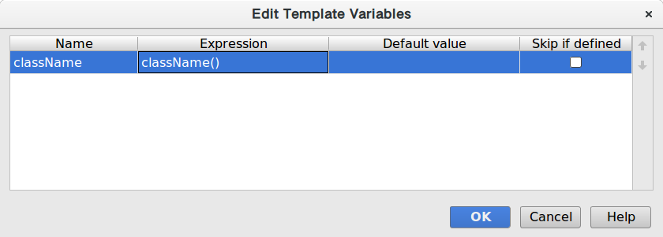

# Idea配置总结

## 代码模板

在工作中发现要大量写一些有固定模式的代码，比如声明一个logger: 

```java
private static Logger logger = LoggerFactory.getLogger(Object.class);
```

这种代码写起来真的很没劲，于是灵机一动的我在想能不能让idea给我自动生成？ 百度了一下发现原来有个Live template的功能就是为这个需求而生的，而且已经内置了一些默认的代码模板，比如`fori`展开成for循环等等。看来idea还是博大精深还有许多功能没仔细研究。  
既然已经找到了，编写一个logger的模板还是很简单的：

```java
private static Logger logger = LoggerFactory.getLogger($className$.class);
```

需要注意的是要把`$className$`变量设置成内置的类名称函数`className()`，这样会自动生成正确的类名；`Abbreviation`设置成`log`，`Applicable Context`选择`Java/Declaration`。



这个仅仅是个小菜，真正让我拍手称快的是自动生成从一种list到另一种list的转换的代码模板。工作中用的是jdk1.7的语法，不能用lambda表达式，因此一些list转换则变得十分繁琐，要定义一个又一个私有方法来完成这种转换，或者使用guava的Lists.transform\(\)方法，但是匿名内部类的使用又使得代码变得不够优雅，而且官方也不推荐这么用。但是我们可以定义一个模板来自动化的完成这种转换：

```java
private List<$to$> to$to$List(List <$from$> inputList) {
    List<$to$> list = Lists.newArrayList();
    for ($from$ input : inputList) {
        if ($checkNull$) {
            continue;
        }
        $convert$
        if ($checkElement$) {
            list.add($element$);
        }
    }

    return list;
}
```

不得不说idea是一个神器，神器在手，就看你能不能用好了。

## 虚拟空间

开启编辑器的虚拟空间功能，实现类似sublime Text的效果：


勾选上`File` -> `Settings` -> `Editor` -> `Show virtual space at file bottom`。

参考：[scrolling past the end in IDEA](https://stackoverflow.com/questions/36715803/scrolling-past-the-end-in-idea)

## 快捷键

| **功能**                  | Macos默认快捷键 |
| ------------------------- | --------------- |
| Go to Implementation(s)   | ⌥⌘B             |
| File Structure            | ⌘F12            |
| Find Usage                | ⌥F7             |
| Quick Documentation       | F1              |
| Optimize Imports          | ⌃⌥O             |
| Find                      | ⌘F              |
| Replace                   | ⌘R              |
| Undo                      | ⌘Z              |
| Redo                      | ⇧⌘Z             |
| Select All                | ⌘A              |
| Show Diff                 | ⌘D              |
| Comment with Line Comment | ⌘/              |

覆盖MacOS⌘H快捷键：

系统偏好设置 -> 键盘 -> 快捷键 -> App快捷键 -> 点击加号按钮创建。注意菜单名称要跟 IDEA中原先的一模一样，设置一个不常用的新快捷键：


