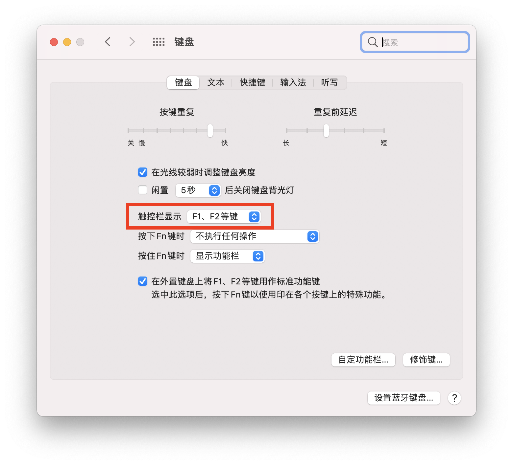
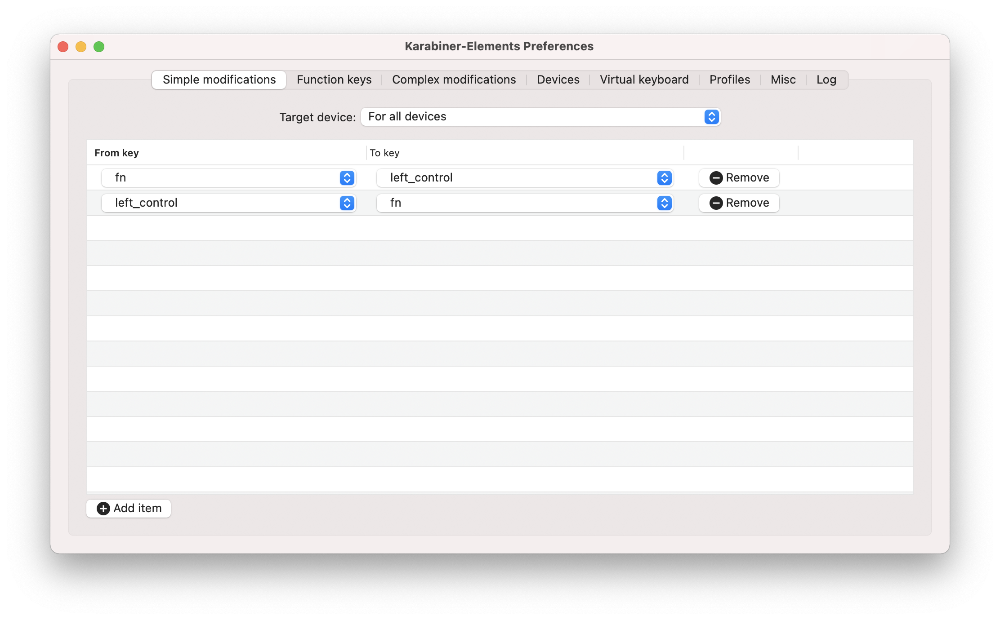

# MacOS开发环境最佳实践

## 系统实用工具

在Finder路径` /System/Library/CoreServices/Applications`下藏着一堆系统工具：


## 安装Homebrew

下载安装脚本：

```bash
curl -fsSL https://raw.githubusercontent.com/Homebrew/install/master/install.sh > install.sh
```

替换中科大镜像源：

```shell
BREW_REPO = "git://mirrors.ustc.edu.cn/brew.git"
```

执行安装脚本：

```shell
sh ./install.sh
```

替换homebrew源为中科大镜像源：

```shell
cd "$(brew --repo)"
git remote set-url origin git://mirrors.ustc.edu.cn/brew.git
```

设置 bintray镜像：

```shell
echo 'export HOMEBREW_BOTTLE_DOMAIN=https://mirrors.ustc.edu.cn/homebrew-bottles' >> ~/.bash_profile
```

修改homebrew-core源为中科大镜像源：

```shell
/usr/local/Homebrew/Library/Homebrew/brew.sh 
HOMEBREW_CORE_DEFAULT_GIT_REMOTE="https://github.com/Homebrew/homebrew-core"
```

更新：

```shell
brew update
```

参考：[Homebrew Core 源使用帮助](http://mirrors.ustc.edu.cn/help/homebrew-core.git.html)

## 安装GNU命令

```bash
brew install coreutils
brew install binutils
brew install diffutils
brew install ed
brew install findutils
brew install gawk
brew install gnu-indent
brew install gnu-sed
brew install gnu-tar
brew install gnu-which
brew install gnutls
brew install grep
brew install gzip
brew install screen
brew install watch
brew install wdiff
brew install wget
```

默认安装的GNU的命令都会加个“g”的前缀，比如  sed会变成gsed。 之前版本的brew的install命令中可能会有`--with-default-names`选项 ，可以直接替换默认的命令名。新版本的brew去掉了这个选项，在安装完成后会提示以配置环境变量的方式替换默认命令名。

添加以下环境变量替换默认命令名：

```bash
export PATH="/usr/local/opt/binutils/bin:$PATH"
export PATH="/usr/local/opt/ed/libexec/gnubin:$PATH"
export PATH="/usr/local/opt/openssl@1.1/bin:$PATH"
export PATH="/usr/local/opt/grep/libexec/gnubin:$PATH"
export PATH="/usr/local/opt/gnu-sed/libexec/gnubin:$PATH"
export PATH="/usr/local/opt/gnu-tar/libexec/gnubin:$PATH"
export PATH="/usr/local/opt/gnu-which/libexec/gnubin:$PATH"
export PATH="/usr/local/opt/gnu-indent/libexec/gnubin:$PATH"
export PATH="/usr/local/opt/findutils/libexec/gnubin:$PATH"
export PATH="/usr/local/opt/coreutils/libexec/gnubin:$PATH"
```

参考：[Install and Use GNU Command Line Tools on macOS/OS X](https://www.topbug.net/blog/2013/04/14/install-and-use-gnu-command-line-tools-in-mac-os-x/)

## 配置

### 开启F1 - F12功能键

关于 -> 系统偏好设置 -> 键盘：



### 交换Fn键和Ctrl键

安装[Karabiner-Elements](https://karabiner-elements.pqrs.org/)并配置如下：


