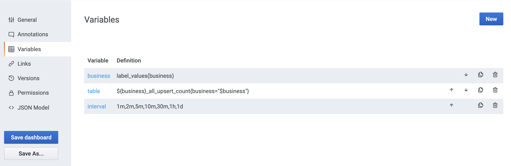

# 监控和报警

## Prometheus

### Metrics类型

[使用Prometheus计算百分位数值](https://cloud.tencent.com/developer/news/319419)

Counter速率总和：

```sql
sum(rate(${business}_all_upsert_count{business="$business",table="${table}"}[$interval]))
```

Counter增量总和：

```
sum(increase(${business}_all_upsert_count{business="$business",table="${table}"}[$interval]))
```

Summary 按分位聚合求平均：

```sql
avg by (quantile) (${business}_upsert_batch_summary{business="$business",table="$table"})
```

Grafana Query语法：

| 名称                        | 描述                                           |
| :-------------------------- | :--------------------------------------------- |
| label_values(label)         | 返回label每个指标中的标签值列表。              |
| label_values(metric, label) | 返回label指定度量标准中的标签值列表。          |
| metrics(metric)             | 返回与指定metric正则表达式匹配的度量标准列表。 |
| query_result(query)         | 返回一个Prometheus查询结果列表query。          |

参考：

[Prometheus FUNCTIONS](https://prometheus.io/docs/prometheus/latest/querying/functions)

[Prometheus Metric names and labels](https://prometheus.io/docs/concepts/data_model/#metric-names-and-labels)

[Prometheus METRIC AND LABEL NAMING](https://prometheus.io/docs/practices/naming/)

[QUERYING PROMETHEUS](https://prometheus.io/docs/prometheus/latest/querying/basics/)

[Prometheus 中文文档 ](https://prometheus.fuckcloudnative.io/)

[深入理解Prometheus（GO SDK及Grafana基本面板）](https://blog.csdn.net/RA681t58CJxsgCkJ31/article/details/102578186)

## Grafana

Grafana 动态级联菜单 （自定义template）：



一级变量：


二级变量：


参考：

[Grafana 动态级联菜单 （自定义template）](https://www.jianshu.com/p/3622a08d8640)