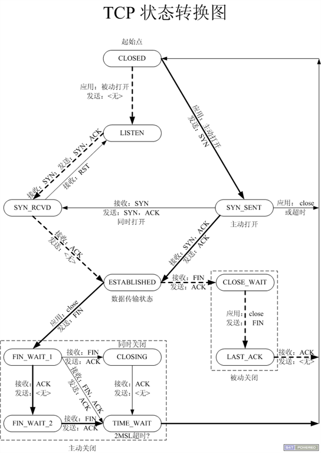
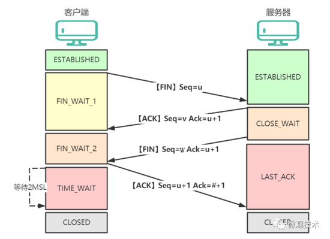

# 计算机网络笔记

## TCP

### TCP三次握手

#### 为什么是三次握手，而不是两次或四次？

如果只有两次握手，那么服务端向客户端发送 SYN/ACK 报文后，就会认为连接建立。但是如果客户端没有收到报文，那么客户端是没有建立连接的，这就导致服务端会浪费资源。

### TCP 数据传输

「重传」和「去重」

### TCP四次挥手

#### 大量的 TIME_WAIT 状态 TCP 连接，对业务有什么影响？怎么处理？

在高并发的场景下，TIME_WAIT 连接存在，属于正常现象。本质原因是大量的短连接存在。

大量的 TIME_WAIT 状态 TCP 连接对业务的影响：

每一个 time_wait 状态，都会占用一个「本地端口」，上限为 65535(16 bit，2 Byte)；
当大量的连接处于 time_wait 时，新建立 TCP 连接会出错`address already in use : connect` 异常

一般解决办法：

- 客户端，HTTP 请求的头部，connection 设置为 keep-alive

- 服务器端：允许 time_wait 状态的 socket 被重用；缩减 time_wait 时间

#### 为什么需要四次挥手？

TCP 是 全双工 。一方关闭连接后，另一方还可以继续发送数据。所以四次挥手，将断开连接分成两个独立的过程。

#### 客户端 TIME-WAIT ，为什么要等待 2MSL 才进入 CLOSED 状态？

MSL 是报文段在网络上最大存活时间。确保 ACK 报文能够到达服务端，从而使服务端正常关闭连接。客户端在发送完最后一个 ACK 报文段后，再经过 2MSL，就可以保证本连接持续的时间内产生的所有报文段都从网络中消失。这样就可以使下一个连接中不会出现这种旧的连接请求报文段。

### 参考

[跟着动画来学习TCP三次握手和四次挥手](https://www.tuicool.com/articles/imaiQfm?from=timeline)

[TCP网络那点破事！三次握手、四次挥手、TIME-WAIT、HTTP 2.0 ....](https://www.tuicool.com/articles/MfUF3yM)

[大量的 TIME_WAIT 状态 TCP 连接，对业务有什么影响？怎么处理？](https://mp.weixin.qq.com/s/Ubs_R05d15Rb0OBEpPXlXw)