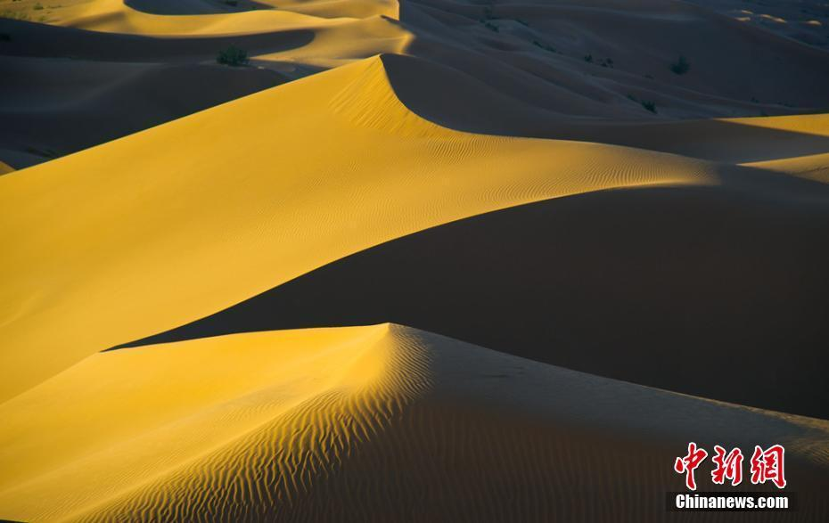

### 2019/04 贵州毕节

[贵州毕节杜鹃迎最佳观赏期 百里繁花绘成“地球彩带”](http://www.chinanews.com/tp/hd2011/2019/04-07/876445.shtml)

### 2019/06 白石山

### 2019/07 海云台

### 2019/07 甘肃库木塔格大沙漠

[甘肃库木塔格大沙漠犹如“金色海洋”](https://3w.huanqiu.com/a/58ef16/7OgDGQoaMve?p=1&agt=8)

