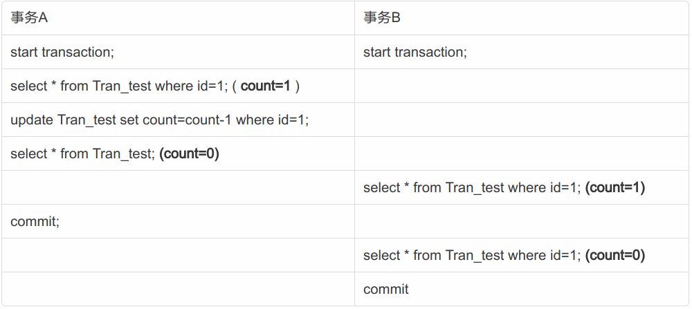

# 数据库事务

## 事务

**事务开始于：**

- 连接到数据库上，并执行一条DML语句insert、update或delete
- 前一个事务结束后，又输入了另一条DML语句 

**事务结束于：**

- 执行commit或rollback语句。
- 执行一条DDL语句，例如create table，grant语句，在这种情况下，会自动执行commit语句。
- 断开与数据库的连接
- 执行了一条DML语句，该语句却失败了，在这种情况中，会为这个无效的DML语句执行rollback语句。

**事务的四大特点（ACID）**

- **actomicity(原子性)**　表示一个事务内的所有操作是一个整体，要么全部成功，要么全部失败

- **consistency(一致性)**　表示一个事务内有一个操作失败时，所有的更改过的数据都必须回滚到修改前状态

- **isolation(隔离性)** 事务查看数据时数据所处的状态，要么是另一并发事务修改它之前的状态，要么是另一事务修改它之后的状态，事务不会查看中间状态的数据。

- **durability(持久性)**　持久性事务完成之后，它对于系统的影响是永久性的。

**隔离级别** 

com.mysql.jdbc.Connection的定义有5个级别:

1. TRANSACTION_NONE(不支持事务)
2. TRANSACTION_READ_UNCOMMITTED
3. TRANSACTION_READ_COMMITTED
4. TRANSACTION_REPEATABLE_READ
5. TRANSACTION_SERIALIZABLE

**脏读**

事务A修改了一个数据，但未提交，事务B读到了事务A未提交的更新结果，如果事务A提交失败，事务B读到的就是脏数据。

**不可重复读**

在同一个事务中，对于同一份数据读取到的结果不一致。比如，事务B在事务A提交前读到的结果，和事务A提交后读到的结果可能不同。

**幻读**

在事务中，前后两次查询，记录数量是不一样的。不可重复读的和幻读很容易混淆，不可重复读侧重于 **修改** ，幻读侧重于 **新增或删除** 。解决不可重复读的问题只需锁住满足条件的行，解决幻读需要 **锁表** 。

**mysql的可重复读一并解决了幻读的问题。**

| 隔离级别 |                  | 脏读 | 不可重复读 | 幻读        |
| -------- | ---------------- | ---- | ---------- | ----------- |
| 未提交读 | READ_UNCOMMITTED | T    | T          | T           |
| 提交读   | READ_COMMITTED   |      | T          | T           |
| 可重复读 | REPEATABLE_READ  |      |            | T(MySQL为F) |
| 可串行化 | SERIALIZABLE     |      |            |             |

## MVCC

### 解决的问题

数据库并发3种场景：

| 场景 | 存在问题                               | 并发控制 |
| ---- | -------------------------------------- | -------- |
| 读读 | 无                                     | 不需要   |
| 读写 | 事务隔离性问题：脏读，幻读，不可重复读 | 需要     |
| 写写 | 更新丢失问题                           | 需要     |

MVCC是一种用来解决读写冲突的无锁并发控制。也就是为事务分配单向增长的时间戳，为每个修改保存一个版本，版本与事务时间戳关联，读操作只读该事务开始前的数据库快照。

所以MVCC可以为数据库解决以下问题：

1. 在并发读写数据库时，可以做到在读操作时不用阻塞写操作，写操作也不用阻塞读操作，提高了数据库并发读写的性能
2. 解决脏读、幻读、不可重复读的事务隔离问题，但是不能解决更新丢失问题

### 参考

[MVCC解决的问题是什么？](https://www.zhihu.com/zvideo/1388975544206282752)

[乐观锁和 MVCC 的区别？](https://www.zhihu.com/question/27876575)

[华为云 MVCC](https://www.huaweicloud.com/articles/d4b79174452538b68954fea1b406b303.html)

